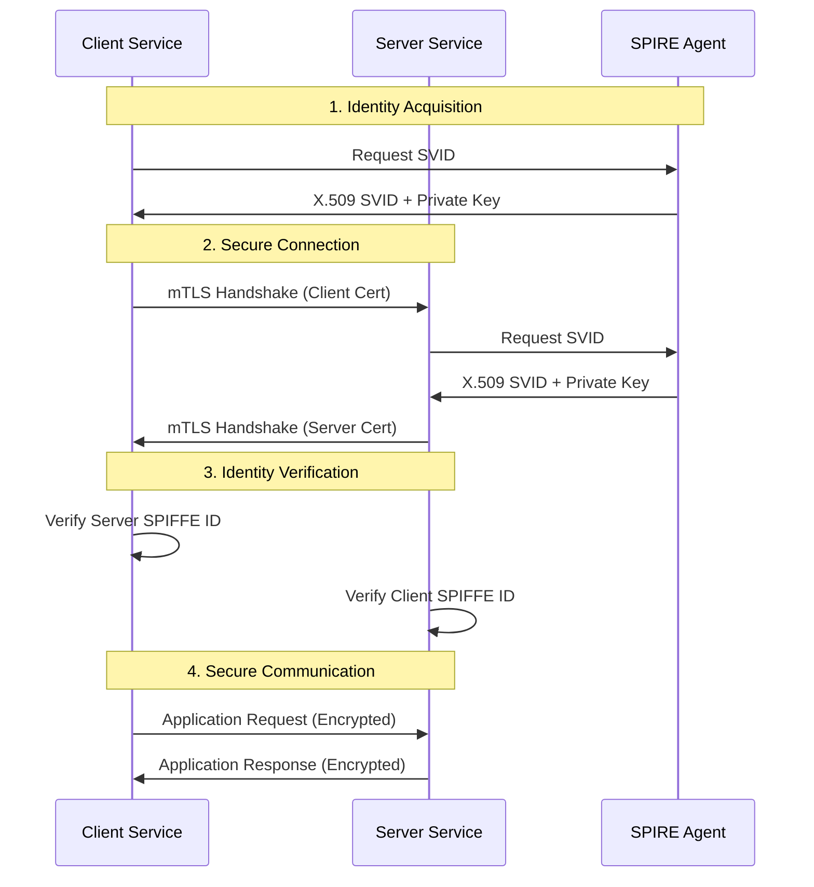

# Ephemos Architecture Guide

This document provides detailed technical architecture information for developers building services with the Ephemos library.

## Table of Contents
- [Core Architecture](#core-architecture)
- [Component Overview](#component-overview)
- [Identity-Based Authentication Flow](#identity-based-authentication-flow)
- [SPIFFE/SPIRE Integration](#spiffespire-integration)
- [Service Registration and Discovery](#service-registration-and-discovery)
- [Security Model](#security-model)
- [Performance Considerations](#performance-considerations)

## Core Architecture

Ephemos follows clean architecture principles with clear separation of concerns:

```
┌─────────────────────────────────────────────────────────────┐
│                    Application Layer                        │
├─────────────────────────────────────────────────────────────┤
│  cmd/ephemos-cli/   │  examples/echo-server/  │  examples/  │
│      main.go        │       main.go           │echo-client/ │
└─────────────────────────────────────────────────────────────┘
                                │
┌─────────────────────────────────────────────────────────────┐
│                   Interface Layer                           │
├─────────────────────────────────────────────────────────────┤
│        internal/adapters/primary/                          │
│  ┌─────────────┐  ┌─────────────┐  ┌─────────────────────┐ │
│  │     API     │  │     CLI     │  │   Service Registry  │ │
│  │   Adapter   │  │   Adapter   │  │      Adapter        │ │
│  └─────────────┘  └─────────────┘  └─────────────────────┘ │
└─────────────────────────────────────────────────────────────┘
                                │
┌─────────────────────────────────────────────────────────────┐
│                    Business Layer                           │
├─────────────────────────────────────────────────────────────┤
│              internal/core/                                 │
│  ┌─────────────┐  ┌─────────────┐  ┌─────────────────────┐ │
│  │   Domain    │  │   Ports     │  │      Services       │ │
│  │   Models    │  │(Interfaces) │  │   (Use Cases)       │ │
│  └─────────────┘  └─────────────┘  └─────────────────────┘ │
└─────────────────────────────────────────────────────────────┘
                                │
┌─────────────────────────────────────────────────────────────┐
│                Infrastructure Layer                         │
├─────────────────────────────────────────────────────────────┤
│        internal/adapters/secondary/                        │
│  ┌─────────────┐  ┌─────────────┐  ┌─────────────────────┐ │
│  │   SPIFFE    │  │   Config    │  │     Transport       │ │
│  │   Provider  │  │   Provider  │  │      Adapter        │ │
│  └─────────────┘  └─────────────┘  └─────────────────────┘ │
└─────────────────────────────────────────────────────────────┘
```

## Component Overview

### Domain Layer (`internal/core/domain/`)
- **ServiceIdentity**: Represents a service's cryptographic identity
- **Certificate**: Manages X.509 certificates and private keys
- **TrustBundle**: Contains trusted certificate authorities

### Ports Layer (`internal/core/ports/`)
- **IdentityProvider**: Interface for identity management
- **ConfigurationProvider**: Interface for configuration loading
- **Transport**: Interface for secure transport implementations

### Services Layer (`internal/core/services/`)
- **IdentityService**: Orchestrates identity operations
- **RegistrationService**: Handles service registration flows

### Adapters

#### Primary Adapters (Inbound)
- **API Adapter**: HTTP/gRPC endpoints for service communication
- **CLI Adapter**: Command-line interface for administrative tasks
- **Service Registry**: Registration and discovery mechanisms

#### Secondary Adapters (Outbound)
- **SPIFFE Provider**: Integrates with SPIRE for identity management
- **Config Provider**: Loads configuration from files/environment
- **Transport Adapter**: Implements secure gRPC transport

## Identity-Based Authentication Flow



## SPIFFE/SPIRE Integration

### SPIFFE ID Structure
```
spiffe://trust-domain/path/to/service
```

Examples:
- `spiffe://example.org/echo-server` - Echo server service
- `spiffe://example.org/echo-client` - Echo client service
- `spiffe://example.org/registration-service` - Registration service

### Certificate Lifecycle

1. **Bootstrap**: Service starts and connects to SPIRE agent via Unix socket
2. **Attestation**: SPIRE agent validates service identity using node attestation
3. **SVID Issuance**: Agent issues short-lived X.509 SVID to service
4. **Rotation**: Ephemos automatically rotates certificates before expiration
5. **Revocation**: SPIRE handles certificate revocation through CRL/OCSP

### Trust Bundle Management

```go
// Trust bundle contains CA certificates for verifying peer identities
type TrustBundle struct {
    Certificates []*x509.Certificate
    TrustDomain  string
    Revision     int64
}
```

## Service Registration and Discovery

### Registration Flow

1. **Service Startup**: Service loads configuration and connects to SPIRE
2. **Identity Verification**: Service proves its identity to registration service
3. **Capability Registration**: Service registers its capabilities and endpoints
4. **Health Monitoring**: Periodic health checks maintain registration

### Discovery Mechanisms

- **Direct Configuration**: Services configured with explicit peer endpoints
- **Registry Service**: Centralized service registry for dynamic discovery
- **DNS-based**: SPIFFE IDs mapped to DNS names for resolution

## Security Model

### Threat Model

**Protected Against:**
- Network eavesdropping (encryption in transit)
- Service impersonation (cryptographic identity)
- Credential theft (short-lived certificates)
- Unauthorized access (authorization policies)

**Assumptions:**
- SPIRE infrastructure is trusted and secure
- Node attestation mechanisms are reliable
- Certificate authorities are properly secured
- Application logic handles authorization correctly

### Security Boundaries

```
┌─────────────────────────────────────────┐
│              Trust Domain               │
│  ┌─────────────┐    ┌─────────────────┐ │
│  │   Service   │◄──►│     Service     │ │
│  │      A      │    │        B        │ │
│  └─────────────┘    └─────────────────┘ │
└─────────────────────────────────────────┘
                    │
            ┌───────────────┐
            │ SPIRE Server  │
            │   (Root CA)   │
            └───────────────┘
```

### Authorization Policies

Services can implement fine-grained authorization:

```go
// Example authorization policy
func (s *EchoServer) authorizeRequest(ctx context.Context, req *EchoRequest) error {
    identity := ephemos.GetIdentityFromContext(ctx)
    
    // Only allow specific clients
    allowedClients := []string{
        "spiffe://example.org/echo-client",
        "spiffe://example.org/admin-client",
    }
    
    for _, allowed := range allowedClients {
        if identity.URI == allowed {
            return nil
        }
    }
    
    return fmt.Errorf("unauthorized client: %s", identity.URI)
}
```

## Performance Considerations

### Certificate Caching

Ephemos caches certificates in memory to avoid repeated SPIRE agent calls:

- **Cache TTL**: Certificates cached until 50% of their lifetime
- **Automatic Refresh**: Background rotation prevents service interruption
- **Memory Usage**: Minimal overhead (~1KB per cached certificate)

### Connection Pooling

- **gRPC Connections**: Reused across multiple requests
- **Connection Limits**: Configurable per-destination limits
- **Health Checking**: Automatic connection health monitoring

### Scalability Metrics

- **Certificate Operations**: ~1000 ops/sec per SPIRE agent
- **mTLS Handshakes**: ~100-500/sec depending on certificate size
- **Memory Overhead**: ~5-10MB per service process
- **Network Latency**: +2-5ms per request for identity verification

### Optimization Guidelines

1. **Minimize Certificate Requests**: Cache aggressively within TTL bounds
2. **Connection Reuse**: Use connection pooling for high-throughput services
3. **Batch Operations**: Group multiple requests when possible
4. **Monitor Metrics**: Track certificate rotation and connection health

## Integration Patterns

### Microservices Architecture

```yaml
# Service mesh integration
apiVersion: v1
kind: ConfigMap
metadata:
  name: ephemos-config
data:
  config.yaml: |
    service:
      name: echo-server
      domain: example.org
    spiffe:
      socket_path: /var/run/spire/sockets/agent.sock
    authorized_clients:
      - spiffe://example.org/echo-client
      - spiffe://example.org/gateway
```

### Kubernetes Deployment

```yaml
apiVersion: apps/v1
kind: Deployment
metadata:
  name: echo-server
spec:
  template:
    spec:
      volumes:
        - name: spire-agent-socket
          hostPath:
            path: /run/spire/sockets
            type: Directory
      containers:
        - name: echo-server
          image: echo-server:latest
          volumeMounts:
            - name: spire-agent-socket
              mountPath: /var/run/spire/sockets
              readOnly: true
```

### Development vs Production

| Aspect | Development | Production |
|--------|-------------|------------|
| Certificate Lifetime | 1 hour | 1 hour |
| Trust Domain | `example.org` | Company domain |
| SPIRE Backend | SQLite | PostgreSQL/MySQL |
| Node Attestation | k8s_sat | TPM/AWS IAM |
| Monitoring | Basic logs | Full observability |
| High Availability | Single instance | Clustered SPIRE |

---

This architecture enables secure, scalable, and maintainable service-to-service communication through identity-based authentication and zero-trust networking principles.