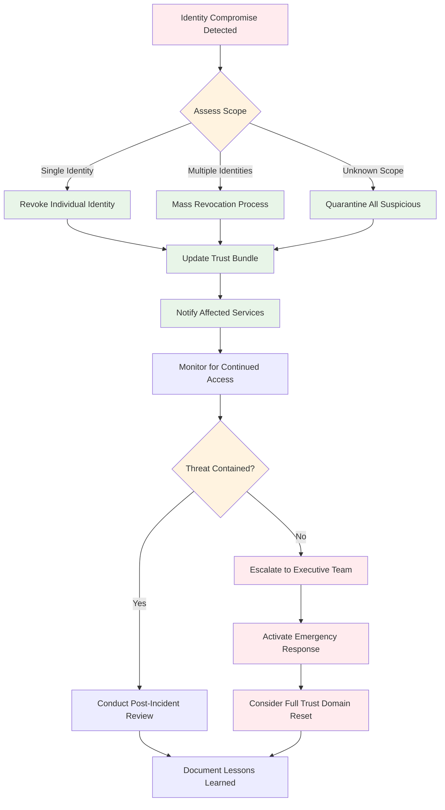
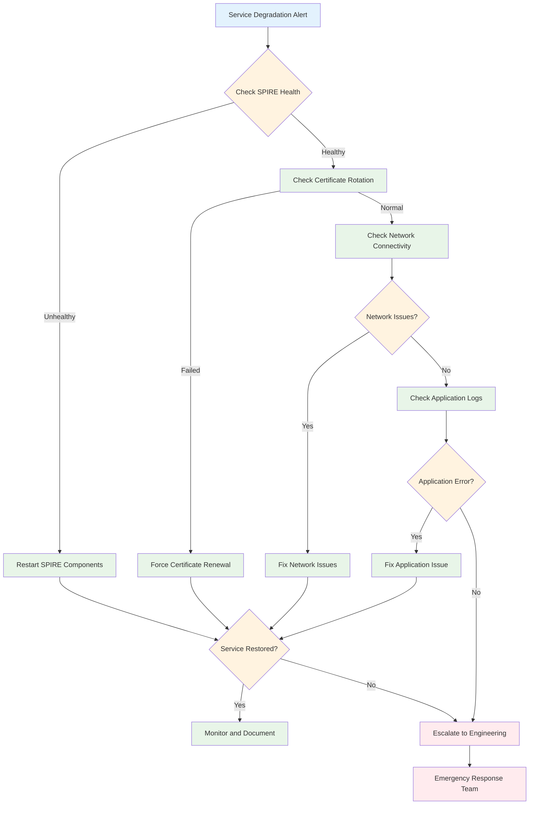
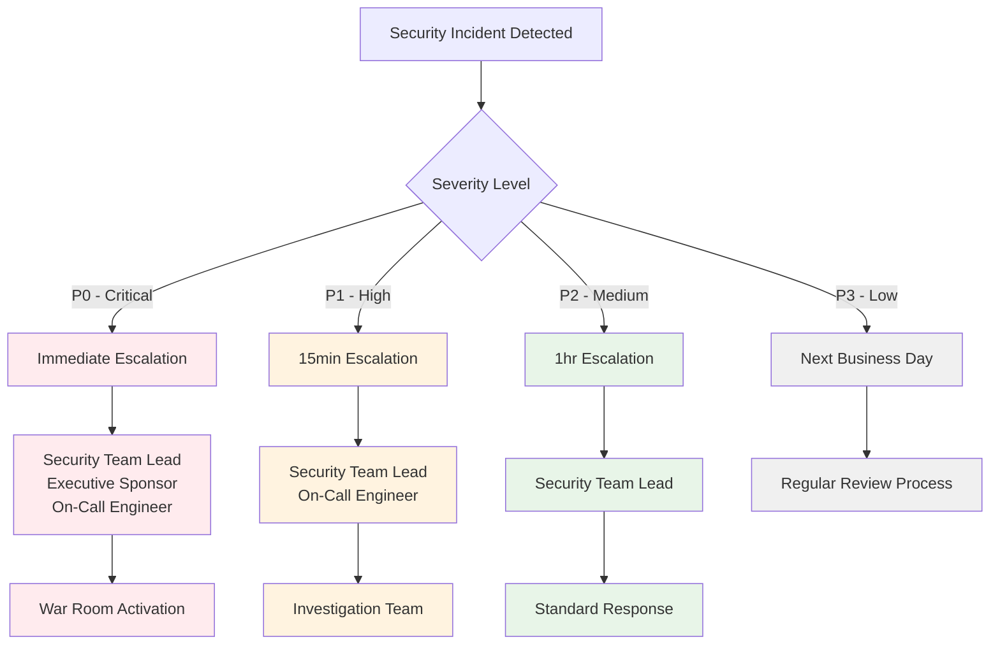

# Ephemos Security Runbook

This runbook provides step-by-step procedures for responding to security incidents and maintaining the security posture of Ephemos deployments.

## Quick Reference

### Emergency Contacts

| Role | Contact | Escalation Time |
|------|---------|-----------------|
| **Security Team Lead** | security-lead@company.com | Immediate |
| **SPIRE Administrator** | spire-admin@company.com | 15 minutes |
| **On-Call Engineer** | oncall@company.com | 5 minutes |
| **Executive Sponsor** | exec-sponsor@company.com | 30 minutes |

### Critical Commands

```bash
# Emergency identity revocation
spire-server entry delete -spiffeID spiffe://trust.domain/compromised/service

# Check SPIRE health
spire-server healthcheck
spire-agent healthcheck

# View current registrations
spire-server entry show

# Force certificate rotation
systemctl restart spire-agent

# Check audit logs
tail -f /var/log/spire/audit.log | jq '.'
```

## Incident Response Procedures

### 1. Identity Compromise Response



#### Step 1: Immediate Response (0-5 minutes)

```bash
#!/bin/bash
# Identity compromise immediate response script

set -e

COMPROMISED_SPIFFE_ID="$1"
INCIDENT_ID="$2"

echo "=== EMERGENCY IDENTITY REVOCATION ==="
echo "Incident ID: $INCIDENT_ID"
echo "Compromised Identity: $COMPROMISED_SPIFFE_ID"
echo "Timestamp: $(date -u)"

# 1. Revoke the compromised identity
echo "Step 1: Revoking compromised identity..."
spire-server entry delete \
  -spiffeID "$COMPROMISED_SPIFFE_ID" \
  -socketPath /tmp/spire-server/private/api.sock

# 2. Log the action
echo "Step 2: Logging revocation action..."
logger -t spire-emergency "REVOKED: $COMPROMISED_SPIFFE_ID for incident $INCIDENT_ID"

# 3. Update monitoring system
echo "Step 3: Notifying monitoring..."
curl -X POST "http://monitoring.internal/api/incidents" \
  -H "Content-Type: application/json" \
  -d "{\"incident_id\":\"$INCIDENT_ID\",\"action\":\"identity_revoked\",\"target\":\"$COMPROMISED_SPIFFE_ID\"}"

# 4. Check for related identities
echo "Step 4: Checking for related identities..."
spire-server entry show | grep "$(echo $COMPROMISED_SPIFFE_ID | cut -d'/' -f4)" || true

echo "=== IMMEDIATE RESPONSE COMPLETE ==="
echo "Next: Run extended investigation script"
```

#### Step 2: Extended Investigation (5-30 minutes)

```bash
#!/bin/bash
# Extended investigation script

INCIDENT_ID="$1"
COMPROMISED_SPIFFE_ID="$2"

echo "=== EXTENDED INVESTIGATION ==="
echo "Incident ID: $INCIDENT_ID"

# 1. Collect forensic data
echo "Collecting audit logs..."
mkdir -p /tmp/incident-$INCIDENT_ID
grep "$COMPROMISED_SPIFFE_ID" /var/log/spire/audit.log > /tmp/incident-$INCIDENT_ID/audit.log

# 2. Check for lateral movement
echo "Checking for lateral movement..."
grep -C 10 "$COMPROMISED_SPIFFE_ID" /var/log/spire/server.log > /tmp/incident-$INCIDENT_ID/server.log

# 3. Identify affected services
echo "Identifying affected services..."
ss -tuln | grep :8443 > /tmp/incident-$INCIDENT_ID/network.log

# 4. Generate timeline
echo "Generating incident timeline..."
awk -v id="$COMPROMISED_SPIFFE_ID" '$0 ~ id {print $1" "$2" "$0}' \
  /var/log/spire/*.log | sort > /tmp/incident-$INCIDENT_ID/timeline.log

echo "=== INVESTIGATION DATA COLLECTED ==="
echo "Location: /tmp/incident-$INCIDENT_ID/"
```

### 2. Certificate Authority Compromise

#### Emergency CA Rotation Procedure

```bash
#!/bin/bash
# Emergency CA rotation procedure

set -e

echo "=== EMERGENCY CA ROTATION ==="
echo "WARNING: This will invalidate ALL certificates"
echo "Press CTRL+C to abort, or wait 10 seconds to continue..."
sleep 10

# 1. Generate new CA
echo "Step 1: Generating new CA..."
mkdir -p /opt/spire/emergency-ca
openssl genrsa -out /opt/spire/emergency-ca/ca-key.pem 4096
openssl req -new -x509 -days 365 -key /opt/spire/emergency-ca/ca-key.pem \
  -out /opt/spire/emergency-ca/ca-cert.pem \
  -subj "/C=US/ST=CA/L=SF/O=Company/CN=Emergency-CA"

# 2. Backup current CA
echo "Step 2: Backing up current CA..."
cp -r /opt/spire/data/keys /opt/spire/data/keys.backup.$(date +%s)

# 3. Stop SPIRE server
echo "Step 3: Stopping SPIRE server..."
systemctl stop spire-server

# 4. Replace CA keys
echo "Step 4: Replacing CA keys..."
cp /opt/spire/emergency-ca/* /opt/spire/data/keys/

# 5. Update configuration
echo "Step 5: Updating SPIRE configuration..."
# Update upstream authority configuration
sed -i 's|cert_file_path.*|cert_file_path = "/opt/spire/emergency-ca/ca-cert.pem"|' /opt/spire/conf/server.conf
sed -i 's|key_file_path.*|key_file_path = "/opt/spire/emergency-ca/ca-key.pem"|' /opt/spire/conf/server.conf

# 6. Start SPIRE server
echo "Step 6: Starting SPIRE server with new CA..."
systemctl start spire-server

# 7. Verify operation
echo "Step 7: Verifying SPIRE server..."
sleep 10
spire-server healthcheck

# 8. Restart all agents
echo "Step 8: Restarting all SPIRE agents..."
ansible all -i /etc/ansible/hosts -m systemd -a "name=spire-agent state=restarted"

echo "=== EMERGENCY CA ROTATION COMPLETE ==="
echo "All certificates have been invalidated and will be re-issued"
```

### 3. Service Degradation Response

#### Performance Issue Investigation



## Monitoring and Alerting

### Critical Alerts Configuration

```yaml
# Critical security alerts for Ephemos
alerts:
  - alert: SPIREServerDown
    expr: up{job="spire-server"} == 0
    for: 30s
    labels:
      severity: critical
    annotations:
      summary: "SPIRE Server is down"
      description: "SPIRE Server has been down for more than 30 seconds"
      runbook_url: "https://docs.company.com/runbooks/spire-server-down"
      
  - alert: MassIdentityRevocation
    expr: increase(spire_server_entries_deleted_total[5m]) > 10
    for: 0s
    labels:
      severity: critical
    annotations:
      summary: "Mass identity revocation detected"
      description: "More than 10 identities revoked in 5 minutes"
      runbook_url: "https://docs.company.com/runbooks/mass-revocation"
      
  - alert: AttestationFailureSpike
    expr: rate(spire_agent_attestation_failures_total[5m]) > 0.1
    for: 2m
    labels:
      severity: warning
    annotations:
      summary: "High attestation failure rate"
      description: "Attestation failures above normal threshold"
      runbook_url: "https://docs.company.com/runbooks/attestation-failures"
      
  - alert: CertificateExpiryWarning
    expr: spire_server_cert_expiry_seconds < 86400
    for: 0s
    labels:
      severity: warning
    annotations:
      summary: "Certificate expiring soon"
      description: "Certificate expires in less than 24 hours"
      runbook_url: "https://docs.company.com/runbooks/cert-renewal"
```

### Dashboard Queries

```promql
# Key metrics for Ephemos security monitoring

# Identity provisioning rate
rate(spire_server_entries_created_total[5m])

# Certificate issuance rate  
rate(spire_server_svids_issued_total[5m])

# Authentication success rate
rate(spire_agent_workload_api_connections_total[5m])

# Failed attestation rate
rate(spire_agent_attestation_failures_total[5m])

# Certificate expiry distribution
histogram_quantile(0.95, spire_server_cert_expiry_seconds)

# Active SPIRE agents
count(up{job="spire-agent"})

# Database connection health
spire_server_database_connections_active
```

## Maintenance Procedures

### Weekly Security Checks

```bash
#!/bin/bash
# Weekly security maintenance script

echo "=== WEEKLY SECURITY CHECK ==="
date

# 1. Check certificate expiry
echo "1. Checking certificate expiry..."
spire-server entry show | grep -E "(Expires|SPIFFE ID)" | \
  awk '/SPIFFE ID/{id=$3} /Expires/{print id, $2, $3}' | \
  while read spiffe_id expires_date expires_time; do
    exp_epoch=$(date -d "$expires_date $expires_time" +%s)
    now_epoch=$(date +%s)
    days_left=$(((exp_epoch - now_epoch) / 86400))
    if [ $days_left -lt 7 ]; then
      echo "WARNING: $spiffe_id expires in $days_left days"
    fi
  done

# 2. Check for failed attestations
echo "2. Checking failed attestations..."
failed_count=$(grep "attestation failed" /var/log/spire/agent.log | wc -l)
echo "Failed attestations this week: $failed_count"

# 3. Check audit log integrity
echo "3. Checking audit log integrity..."
if [ -f /var/log/spire/audit.log ]; then
  audit_size=$(stat -c%s /var/log/spire/audit.log)
  echo "Audit log size: $audit_size bytes"
  echo "Recent entries: $(tail -5 /var/log/spire/audit.log | wc -l)"
else
  echo "WARNING: Audit log not found"
fi

# 4. Check SPIRE service status
echo "4. Checking SPIRE service status..."
systemctl is-active spire-server || echo "WARNING: SPIRE server not active"
systemctl is-active spire-agent || echo "WARNING: SPIRE agent not active"

# 5. Generate security summary
echo "5. Generating security summary..."
echo "Total active entries: $(spire-server entry show | grep -c 'Entry ID')"
echo "Total agents connected: $(ss -x | grep -c spire)"

echo "=== WEEKLY CHECK COMPLETE ==="
```

### Monthly Security Review

```bash
#!/bin/bash
# Monthly security review script

echo "=== MONTHLY SECURITY REVIEW ==="

# 1. Generate security metrics
echo "1. Security Metrics Summary"
echo "=========================="

# Count total identities
total_identities=$(spire-server entry show | grep -c "Entry ID")
echo "Total managed identities: $total_identities"

# Analyze certificate lifetimes
echo "Certificate lifetime analysis:"
spire-server entry show | grep -A 5 -B 1 "TTL" | \
  grep "TTL" | sort | uniq -c | sort -nr

# 2. Audit log analysis
echo "2. Audit Log Analysis"
echo "==================="

# Check for suspicious patterns
suspicious_events=$(grep -i "error\|fail\|denied\|unauthorized" /var/log/spire/audit.log | wc -l)
echo "Suspicious events this month: $suspicious_events"

# 3. Performance analysis
echo "3. Performance Analysis"
echo "====================="

# Certificate rotation frequency
rotation_count=$(grep "certificate rotated" /var/log/spire/agent.log | wc -l)
echo "Certificate rotations this month: $rotation_count"

# 4. Compliance check
echo "4. Compliance Check"
echo "=================="

# Check audit log retention
audit_files=$(ls -la /var/log/spire/audit.log* | wc -l)
echo "Audit log files retained: $audit_files"

# Check backup status
if [ -d "/backup/spire" ]; then
  backup_files=$(ls /backup/spire | wc -l)
  echo "Backup files available: $backup_files"
else
  echo "WARNING: Backup directory not found"
fi

echo "=== MONTHLY REVIEW COMPLETE ==="
```

## Troubleshooting Guide

### Common Issues and Solutions

#### 1. SPIRE Agent Cannot Connect to Server

**Symptoms:**
- Agent logs show connection refused
- Workloads cannot obtain identities
- `spire-agent healthcheck` fails

**Investigation:**
```bash
# Check agent status
systemctl status spire-agent

# Check network connectivity
telnet spire-server.internal 8081

# Check agent configuration
grep -E "(server_address|server_port)" /opt/spire/conf/agent.conf

# Check certificates
openssl s_client -connect spire-server.internal:8081 -servername spire-server
```

**Resolution:**
```bash
# Fix common configuration issues
sudo nano /opt/spire/conf/agent.conf  # Check server_address
sudo systemctl restart spire-agent

# Regenerate agent certificates if needed
sudo rm -rf /opt/spire/data/agent_svid.der
sudo systemctl restart spire-agent
```

#### 2. Workload Authentication Failures

**Symptoms:**
- Applications report TLS handshake failures
- Certificate validation errors
- Connection timeouts

**Investigation:**
```bash
# Check workload attestation
grep "workload attestation" /var/log/spire/agent.log

# Verify SPIRE entries
spire-server entry show | grep -A 10 "spiffe://trust.domain/workload/app"

# Check certificate validity
openssl x509 -in /tmp/spire-agent/public/svid.pem -text -noout
```

**Resolution:**
```bash
# Re-register workload if entry missing
spire-server entry create \
  -spiffeID spiffe://trust.domain/workload/app \
  -parentID spiffe://trust.domain/spire-agent \
  -selector unix:uid:1000

# Force certificate refresh
pkill -USR1 $(pgrep spire-agent)
```

#### 3. Performance Degradation

**Symptoms:**
- Slow certificate issuance
- High CPU usage on SPIRE server
- Database connection errors

**Investigation:**
```bash
# Check system resources
top | head -20
df -h
free -m

# Check database performance
psql -h localhost -U spire -d spire -c "\dt+"
psql -h localhost -U spire -d spire -c "SELECT * FROM pg_stat_activity;"

# Check SPIRE metrics
curl -s http://localhost:8080/metrics | grep spire_server
```

**Resolution:**
```bash
# Optimize database
psql -h localhost -U spire -d spire -c "REINDEX DATABASE spire;"
psql -h localhost -U spire -d spire -c "VACUUM ANALYZE;"

# Adjust SPIRE configuration
# Increase database connection pool
sudo nano /opt/spire/conf/server.conf
# Set max_open_conns = 50

sudo systemctl restart spire-server
```

## Recovery Procedures

### Disaster Recovery Checklist

- [ ] **Backup Verification**
  - [ ] SPIRE server database backup available
  - [ ] CA certificates and keys backed up
  - [ ] Configuration files backed up
  
- [ ] **System Recovery**
  - [ ] Restore SPIRE server from backup
  - [ ] Verify database connectivity
  - [ ] Check CA certificate chain
  
- [ ] **Service Restoration**
  - [ ] Start SPIRE server
  - [ ] Verify health check passes
  - [ ] Restart all SPIRE agents
  
- [ ] **Validation**
  - [ ] Test identity provisioning
  - [ ] Verify certificate rotation
  - [ ] Confirm audit logging

### Emergency Contacts and Escalation



---

*This runbook should be tested regularly through tabletop exercises and updated based on lessons learned from real incidents.*