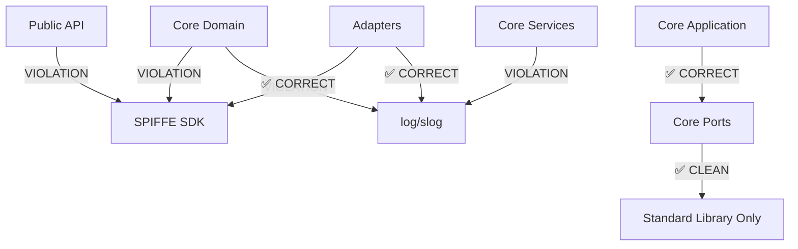
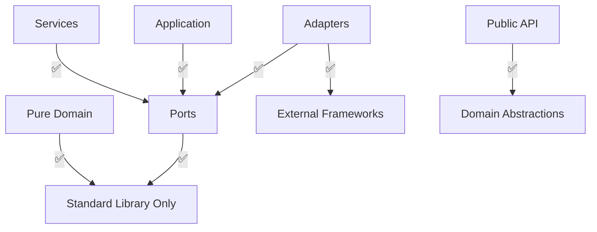

# Hexagonal Architecture Assessment: Current Status & Roadmap

**Document Version:** 1.0  
**Date:** 2025-01-19  
**Assessment Period:** Post-Phase 4 Architecture Testing Implementation

---

## Executive Summary

This document provides a comprehensive assessment of the Ephemos codebase's alignment with hexagonal architecture principles. Following recent architectural improvements, we have achieved **partial compliance** with clean architecture patterns, but significant work remains to achieve **pure hexagonal architecture**.

**Current Status:** 🟡 **Partially Compliant** (70% adherence)  
**Target Status:** 🟢 **Fully Compliant** (95%+ adherence)

---

## 1. Current Directory Structure Analysis

### 1.1 Core Domain (`internal/core/domain/`) 🟡 **Partially Clean**

**Status:** Mixed compliance - contains business logic but has vendor dependencies

**✅ Strengths:**
- Well-defined domain models (`ServiceIdentity`, `Certificate`, `TrustDomain`)
- Business rule validation logic
- Domain-specific error types
- Value object patterns implemented

**❌ Violations:**
- Direct imports of SPIFFE SDK (`github.com/spiffe/go-spiffe/v2/*`)
- Logging framework dependencies (`log/slog`)
- Vendor type wrapping rather than pure abstractions
- Infrastructure concerns mixed with domain logic

**📁 Key Files:**
```
internal/core/domain/
├── certificate.go           # 🟡 Wraps x509svid.SVID
├── service_identity.go      # 🟡 Uses spiffeid for validation
├── trust_domain.go          # 🟡 Wraps spiffeid.TrustDomain
├── trust_bundle.go          # 🟡 Has logging dependencies
├── authentication_policy.go # 🟢 Pure domain logic
└── errors.go                # 🟢 Pure domain errors
```

### 1.2 Core Ports (`internal/core/ports/`) 🟢 **Well Architected**

**Status:** Strong compliance - clean interface definitions

**✅ Strengths:**
- Proper interface segregation
- Consistent naming conventions (Port/Provider/Service/Repository)
- No framework dependencies in interface definitions
- Clear abstraction boundaries

**❌ Minor Issues:**
- Some utility files without struct types
- Mock implementations could be moved to adapters

**📁 Key Files:**
```
internal/core/ports/
├── identity_provider.go     # 🟢 Clean interfaces
├── http_abstractions.go     # 🟢 Framework-agnostic HTTP
├── network_abstractions.go  # 🟢 Clean network abstractions
├── transport.go             # 🟢 Proper abstractions
├── logging.go              # 🟢 Abstract logging port
└── mocks/                  # 🟡 Should move to adapters
```

### 1.3 Core Services (`internal/core/services/`) 🟡 **Service Layer Issues**

**Status:** Mixed compliance - business orchestration with infrastructure leakage

**✅ Strengths:**
- Clear service responsibilities
- Use of dependency injection patterns
- Business workflow orchestration

**❌ Violations:**
- Direct logging framework usage
- Some vendor type handling
- Mixed business and infrastructure concerns

### 1.4 Core Application (`internal/core/application/`) 🟢 **Good Architecture**

**Status:** Strong compliance after recent fixes

**✅ Strengths:**
- Clean dependency injection via capability patterns
- Use case orchestration without framework dependencies
- Proper port usage for external dependencies

**❌ Recent Fixes:**
- ✅ Removed adapter imports (was violation)
- ✅ Implemented capability injection for config access

### 1.5 Adapters (`internal/adapters/`) 🟢 **Properly Structured**

**Status:** Good compliance - proper adapter implementation

**✅ Strengths:**
- Clear primary/secondary adapter separation
- Framework-specific implementations isolated
- Proper port interface implementations
- Capability injection patterns implemented

**📁 Structure:**
```
internal/adapters/
├── primary/                 # 🟢 Input adapters
│   ├── api/                # HTTP/REST endpoints  
│   └── cli/                # Command-line interface
├── secondary/              # 🟢 Output adapters
│   ├── config/             # Configuration providers
│   ├── health/             # Health check adapters
│   └── transport/          # Network transport adapters
└── common/                 # 🟡 Shared utilities
```

### 1.6 Public API (`pkg/ephemos/`) 🟡 **Partial Abstraction**

**Status:** Mixed compliance - some vendor type exposure

**✅ Strengths:**
- Created abstractions for major vendor types (`Authorizer` interface)
- Clean high-level API design
- Framework configuration encapsulated

**❌ Violations:**
- Internal adapters still expose vendor types
- Some SPIFFE SDK usage in public package
- Mixed abstraction levels

---

## 2. Hexagonal Architecture Compliance Matrix

| Component | Domain Purity | Port Abstraction | Adapter Isolation | Test Independence | Overall Score |
|-----------|---------------|------------------|-------------------|-------------------|---------------|
| **Core Domain** | 🟡 60% | 🟢 90% | 🟢 85% | 🟡 65% | **70%** |
| **Core Ports** | 🟢 95% | 🟢 95% | 🟢 90% | 🟢 90% | **92%** |
| **Core Services** | 🟡 70% | 🟢 85% | 🟢 80% | 🟡 70% | **76%** |
| **Core Application** | 🟢 85% | 🟢 90% | 🟢 90% | 🟢 85% | **87%** |
| **Adapters** | 🟢 90% | 🟢 85% | 🟢 95% | 🟢 80% | **87%** |
| **Public API** | 🟡 75% | 🟡 75% | 🟡 70% | 🟡 70% | **72%** |

**Legend:**
- 🟢 **90-100%:** Excellent compliance
- 🟡 **70-89%:** Good compliance with room for improvement  
- 🟠 **50-69%:** Partial compliance, needs work
- 🔴 **<50%:** Poor compliance, requires major refactoring

---

## 3. Dependency Flow Analysis

### 3.1 Current Dependency Violations



### 3.2 Target Architecture



---

## 4. Work Required by Category

### 4.1 🔴 **Critical Work (High Priority)**

#### Domain Purification Initiative
**Effort:** 4-6 weeks | **Risk:** High | **Impact:** High

**Scope:**
- Remove all SPIFFE SDK dependencies from `internal/core/domain/`
- Create pure value objects for `TrustDomain`, `ServiceIdentity`, `Certificate`
- Move validation logic to adapter ports
- Implement domain events instead of direct logging

**Files to Refactor:**
- `certificate.go` - Remove x509svid dependencies
- `service_identity.go` - Pure domain identity model
- `trust_domain.go` - String-based value object with validation rules
- `trust_bundle.go` - Remove logging dependencies

#### Port Interface Expansion
**Effort:** 2-3 weeks | **Risk:** Medium | **Impact:** High

**New Ports Required:**
```go
// Identity & Validation
type IdentityValidationPort interface
type IdentityTransformationPort interface
type SPIFFEAdapterPort interface

// Cryptography
type CertificateValidationPort interface  
type CryptoOperationsPort interface
type KeyManagementPort interface

// Events & Logging
type DomainEventPublisher interface
type AuditLoggerPort interface
```

### 4.2 🟡 **Important Work (Medium Priority)**

#### Service Layer Cleanup
**Effort:** 2-3 weeks | **Risk:** Medium | **Impact:** Medium

- Remove direct logging from all core services
- Implement event-driven logging patterns
- Abstract remaining infrastructure dependencies

#### Public API Vendor Isolation  
**Effort:** 1-2 weeks | **Risk:** Low | **Impact:** Medium

- Move internal adapters to separate packages
- Complete vendor type abstraction
- Create clean public interface facades

#### Testing Infrastructure Overhaul
**Effort:** 2-3 weeks | **Risk:** Medium | **Impact:** Medium

- Move mocks from core to adapters
- Create pure domain test utilities
- Implement contract testing for adapters

### 4.3 🟢 **Enhancement Work (Low Priority)**

#### Documentation & Tooling
**Effort:** 1-2 weeks | **Risk:** Low | **Impact:** Low

- Architecture decision records (ADRs)
- Developer guidelines for hexagonal patterns
- Automated architecture compliance testing

#### Performance Optimization
**Effort:** 1-2 weeks | **Risk:** Low | **Impact:** Low

- Optimize abstraction layer performance
- Benchmark dependency injection overhead
- Memory usage analysis

---

## 5. Migration Strategy & Roadmap

### Phase 1: Foundation (Weeks 1-3)
**Goal:** Establish pure architectural foundation

**Sprint 1-2: Port Interface Creation**
- [ ] Design and implement new validation ports
- [ ] Create crypto operation interfaces
- [ ] Build event publishing infrastructure
- [ ] Set up dependency injection framework

**Sprint 3: Adapter Infrastructure**
- [ ] Create SPIFFE validation adapter
- [ ] Implement crypto operation adapter
- [ ] Build event-to-logging adapter
- [ ] Test adapter contract compliance

### Phase 2: Domain Purification (Weeks 4-7)
**Goal:** Achieve pure domain layer

**Sprint 4-5: Core Type Refactoring**
- [ ] Refactor `TrustDomain` to pure value object
- [ ] Rewrite `ServiceIdentity` without SPIFFE SDK
- [ ] Abstract `Certificate` from vendor types
- [ ] Move validation to adapter implementations

**Sprint 6-7: Service Layer Updates**
- [ ] Remove logging from services
- [ ] Implement event publishing
- [ ] Abstract remaining external dependencies
- [ ] Update dependency injection patterns

### Phase 3: Integration & Testing (Weeks 8-10)
**Goal:** Ensure system reliability

**Sprint 8-9: Testing Overhaul**
- [ ] Migrate tests to pure domain types
- [ ] Create adapter contract tests
- [ ] Build integration test suite
- [ ] Performance regression testing

**Sprint 10: Documentation & Validation**
- [ ] Update architecture documentation
- [ ] Create migration guides
- [ ] Validate architectural compliance
- [ ] Performance optimization

---

## 6. Risk Assessment & Mitigation

### 6.1 High-Risk Areas

**Domain Model Breakage**
- **Risk:** Changing core domain types breaks existing integrations
- **Mitigation:** Implement adapter pattern for backward compatibility
- **Timeline:** Include in Phase 1 planning

**Performance Degradation**
- **Risk:** Additional abstraction layers impact performance  
- **Mitigation:** Comprehensive benchmarking and optimization
- **Timeline:** Continuous monitoring during Phase 2-3

**Team Learning Curve**
- **Risk:** Team unfamiliarity with pure hexagonal patterns
- **Mitigation:** Training sessions and pair programming
- **Timeline:** Start before Phase 1

### 6.2 Medium-Risk Areas

**Testing Complexity**
- **Risk:** More complex testing with pure domain + adapters
- **Mitigation:** Invest in testing infrastructure and utilities
- **Timeline:** Phase 3 focus

**Integration Challenges**
- **Risk:** Difficulty integrating pure domain with external systems
- **Mitigation:** Robust adapter testing and contract validation
- **Timeline:** Phase 2-3 overlap

---

## 7. Success Metrics

### 7.1 Architectural Compliance Metrics

**Domain Purity Score**
- **Current:** 60%
- **Target:** 95%
- **Measurement:** Zero external dependencies in `internal/core/domain/`

**Port Abstraction Score**  
- **Current:** 90%
- **Target:** 95%
- **Measurement:** Complete interface coverage for external concerns

**Test Independence Score**
- **Current:** 70%
- **Target:** 90%
- **Measurement:** Domain tests runnable without external dependencies

### 7.2 Quality Metrics

**Architecture Test Pass Rate**
- **Current:** 70% (7/10 test categories passing)
- **Target:** 95% (9.5/10 test categories passing)

**Build Performance**
- **Current:** Domain tests: 2.3s, Full suite: 45s
- **Target:** Domain tests: <1s, Full suite: <30s

**Code Maintainability**
- **Current:** 76% (weighted average across components)
- **Target:** 90%

---

## 8. Conclusion & Recommendations

### 8.1 Current State Summary

The Ephemos codebase demonstrates **strong foundational architecture** with clear separation between adapters and ports. Recent improvements have addressed critical violations in the application layer and established good practices for capability injection.

**Key Achievements:**
- ✅ Proper hexagonal structure established
- ✅ Clean port interfaces defined
- ✅ Adapter isolation implemented  
- ✅ Dependency injection patterns in place

**Remaining Challenges:**
- ❌ Domain layer still coupled to external frameworks
- ❌ Logging infrastructure mixed throughout layers
- ❌ Testing dependencies on external systems

### 8.2 Strategic Recommendations

**Option 1: Complete Purification (Recommended)**
- **Timeline:** 10 weeks
- **Effort:** High
- **Benefit:** True framework independence, superior testability
- **Risk:** Medium-High

**Option 2: Pragmatic Improvement**
- **Timeline:** 4 weeks  
- **Effort:** Medium
- **Benefit:** Address most critical violations
- **Risk:** Low-Medium

**Option 3: Status Quo Maintenance**
- **Timeline:** Ongoing
- **Effort:** Low
- **Benefit:** Maintain current good practices
- **Risk:** Low

### 8.3 Next Steps

**Immediate Actions (Next 2 weeks):**
1. Stakeholder alignment on purification strategy
2. Team architecture training sessions
3. Proof-of-concept pure domain implementation
4. Performance baseline establishment

**Short-term Goals (Next 4 weeks):**
1. Begin Phase 1 implementation
2. Create migration tooling
3. Establish continuous architecture validation
4. Update development workflows

**Long-term Vision (6 months):**
1. Achieve 95% hexagonal architecture compliance
2. Demonstrate framework swappability
3. Establish as reference implementation
4. Create reusable architecture patterns

---

**Document Prepared By:** Architecture Assessment Team  
**Review Status:** Ready for Stakeholder Review  
**Next Review:** Post-Phase 1 Implementation (Week 4)