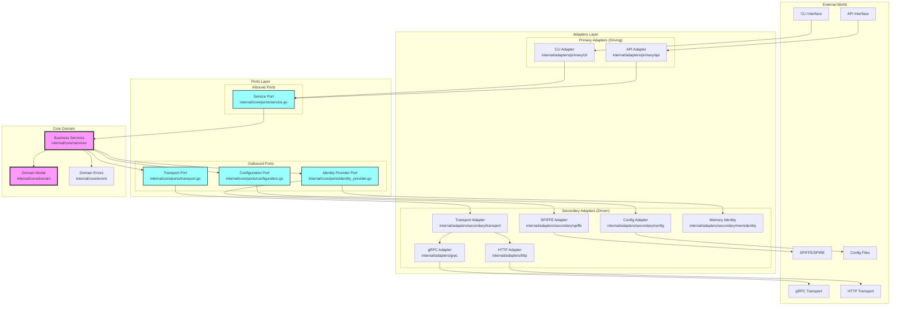
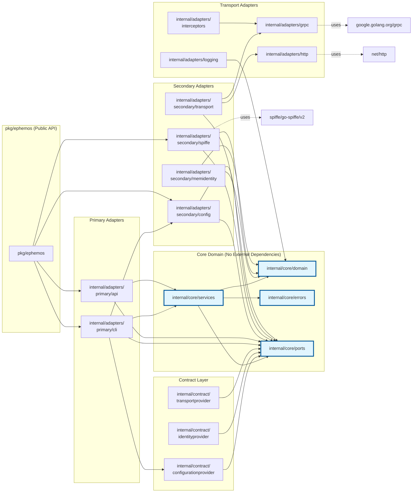
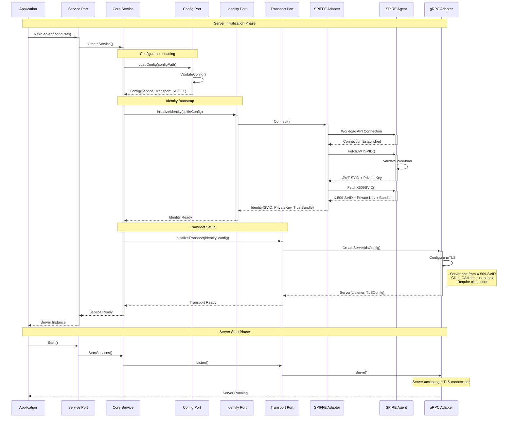
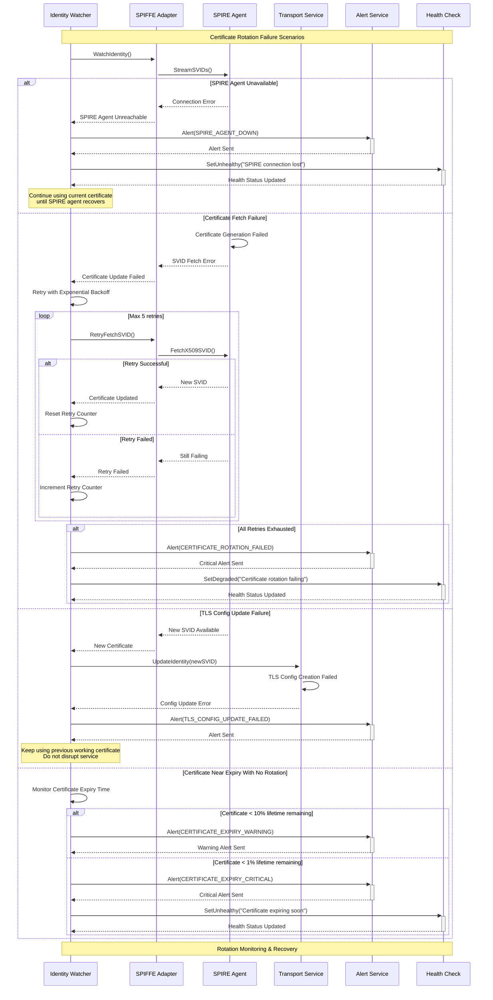

# Ephemos Architecture Documentation

## Hexagonal Architecture (Ports & Adapters)

Ephemos follows a clean hexagonal architecture pattern that enforces strict dependency rules and separation of concerns.

## Dependency Rule Diagram



## Import Graph Snapshot

The following diagram shows the actual import dependencies between packages in the Ephemos architecture:



## Dependency Rules

### ✅ Allowed Dependencies

1. **Core Domain**: 
   - ❌ MUST NOT import from adapters
   - ❌ MUST NOT import from external libraries
   - ✅ CAN import from other core packages

2. **Ports (Interfaces)**:
   - ✅ CAN import from core/domain
   - ❌ MUST NOT import from adapters
   - ❌ MUST NOT import from external libraries

3. **Primary Adapters** (Driving/Inbound):
   - ✅ CAN import from core/ports
   - ✅ CAN import from core/services
   - ✅ CAN import from contracts
   - ✅ CAN import from external libraries
   - ❌ MUST NOT import from other adapters directly

4. **Secondary Adapters** (Driven/Outbound):
   - ✅ CAN import from core/ports
   - ✅ CAN import from core/domain
   - ✅ CAN import from external libraries
   - ❌ MUST NOT import from primary adapters
   - ❌ MUST NOT import from core/services

### 🔍 Import Analysis Summary

Based on the current codebase analysis:

```
Core Domain Packages:
├── internal/core/domain       → No external dependencies ✅
├── internal/core/errors       → No external dependencies ✅
├── internal/core/ports        → Only core/domain imports ✅
└── internal/core/services     → Only core/* imports ✅

Primary Adapters:
├── internal/adapters/primary/cli → Imports core + contracts ✅
└── internal/adapters/primary/api → Imports core + contracts ✅

Secondary Adapters:
├── internal/adapters/secondary/config      → Imports core/ports ✅
├── internal/adapters/secondary/spiffe      → Imports core + SPIFFE lib ✅
├── internal/adapters/secondary/memidentity → Imports core/ports ✅
└── internal/adapters/secondary/transport   → Imports core + transport adapters ✅

Transport Implementations:
├── internal/adapters/grpc         → External gRPC libraries ✅
├── internal/adapters/http         → Standard net/http ✅
├── internal/adapters/interceptors → gRPC interceptors ✅
└── internal/adapters/logging      → Logging utilities ✅
```

## Key Architectural Principles

1. **Dependency Inversion**: Core domain defines interfaces (ports) that adapters implement
2. **Single Responsibility**: Each adapter has one clear responsibility
3. **Interface Segregation**: Ports are small and focused
4. **Clean Boundaries**: No circular dependencies between layers
5. **Testability**: Core can be tested without any external dependencies

## Testing Architecture Compliance

The architecture is enforced through automated tests:

```go
// internal/core/ports/architecture_test.go
func TestNoCoreImportsAdapters(t *testing.T) {
    // Verifies core packages don't import from adapters
}

func TestNoCircularDependencies(t *testing.T) {
    // Ensures no circular imports exist
}
```

## Benefits of This Architecture

1. **Maintainability**: Changes in external systems don't affect core business logic
2. **Testability**: Core domain can be tested in isolation
3. **Flexibility**: Easy to swap implementations (e.g., SPIFFE → OAuth)
4. **Clarity**: Clear separation of concerns and responsibilities
5. **Security**: Security concerns isolated in specific adapters

## Example: Adding a New Transport

To add a new transport (e.g., WebSocket):

1. Create adapter: `internal/adapters/websocket/`
2. Implement transport port: `internal/core/ports/transport.go`
3. Register in transport adapter: `internal/adapters/secondary/transport/`
4. No changes needed in core domain! ✅

## Import Verification Commands

```bash
# Check for illegal imports from core to adapters
go list -f '{{.ImportPath}} {{.Imports}}' ./internal/core/... | grep adapters

# Visualize dependency graph
go mod graph | grep internal/

# Check for circular dependencies
go list -f '{{join .Deps "\n"}}' ./internal/... | sort | uniq -c | sort -rn
```

## Sequence Diagrams

### Server Boot Sequence (SVID Fetch & mTLS Setup)



### Client Connect Sequence

```mermaid
sequenceDiagram
    participant Client as Client App
    participant ClientSvc as Client Service
    participant IdentPort as Identity Port
    participant TransPort as Transport Port
    participant SpiffeAdapter as SPIFFE Adapter
    participant SpireAgent as SPIRE Agent (Client)
    participant GrpcAdapter as gRPC Adapter
    participant Server as Server Process
    participant SpireAgentSrv as SPIRE Agent (Server)
    
    Note over Client, SpireAgentSrv: Client Connection Establishment
    
    Client->>+ClientSvc: NewClient(configPath)
    
    Note over ClientSvc, IdentPort: Client Identity Setup
    ClientSvc->>+IdentPort: GetIdentity()
    IdentPort->>+SpiffeAdapter: FetchCurrentIdentity()
    
    SpiffeAdapter->>+SpireAgent: FetchX509SVID()
    SpireAgent->>SpireAgent: Validate Client Workload
    SpireAgent-->>-SpiffeAdapter: X.509-SVID + Key + Bundle
    
    SpiffeAdapter-->>-IdentPort: ClientIdentity{SVID, Key, Bundle}
    IdentPort-->>-ClientSvc: Identity Ready
    
    Note over ClientSvc, TransPort: Connection Setup
    ClientSvc->>+TransPort: Connect(serverAddress, identity)
    TransPort->>+GrpcAdapter: CreateConnection(tlsConfig)
    
    Note right of GrpcAdapter: Client TLS Config:<br/>- Client cert from X.509-SVID<br/>- Server CA from trust bundle<br/>- SPIFFE ID verification
    
    GrpcAdapter->>+Server: TLS Handshake
    
    Note over Server, SpireAgentSrv: Server-side Validation
    Server->>Server: Validate Client Certificate
    Server->>Server: Extract SPIFFE ID
    Server->>Server: Check Authorized Clients List
    
    alt Client Authorized
        Server-->>GrpcAdapter: TLS Handshake Complete
        GrpcAdapter-->>-TransPort: Secure Connection Established
        TransPort-->>-ClientSvc: Connection Ready
        ClientSvc-->>-Client: Client Ready
        
        Note over Client, Server: Secure mTLS Communication
        Client->>+ClientSvc: MakeRequest(data)
        ClientSvc->>TransPort: Send(encryptedData)
        TransPort->>GrpcAdapter: gRPC Call
        GrpcAdapter->>+Server: Authenticated Request
        Server->>Server: Process Request
        Server-->>-GrpcAdapter: Response
        GrpcAdapter-->>TransPort: gRPC Response
        TransPort-->>ClientSvc: DecryptedResponse
        ClientSvc-->>-Client: Result
        
    else Client Not Authorized
        Server-->>GrpcAdapter: TLS Handshake Failed
        GrpcAdapter-->>-TransPort: Connection Rejected
        TransPort-->>-ClientSvc: AuthorizationError
        ClientSvc-->>-Client: Connection Failed
    end
```

### Certificate Rotation Sequence

```mermaid
sequenceDiagram
    participant App as Application
    participant IdentWatcher as Identity Watcher
    participant SpiffeAdapter as SPIFFE Adapter
    participant SpireAgent as SPIRE Agent
    participant TransService as Transport Service
    participant GrpcServer as gRPC Server
    participant ActiveConns as Active Connections
    participant NewConns as New Connections
    
    Note over App, NewConns: Automatic Certificate Rotation
    
    Note over IdentWatcher, SpireAgent: Background Identity Monitoring
    IdentWatcher->>+SpiffeAdapter: WatchIdentity()
    SpiffeAdapter->>+SpireAgent: StreamSVIDs()
    
    loop Every 30 seconds (configurable)
        SpireAgent->>SpireAgent: Check Certificate Expiry
        
        alt Certificate Near Expiry (< 1/3 lifetime)
            SpireAgent->>SpireAgent: Generate New X.509-SVID
            SpireAgent-->>SpiffeAdapter: NewSVID{Cert, Key, Bundle}
            SpiffeAdapter-->>-IdentWatcher: IdentityUpdated Event
            
            Note over IdentWatcher, TransService: Hot Certificate Reload
            IdentWatcher->>+TransService: UpdateIdentity(newSVID)
            
            TransService->>TransService: Create New TLS Config
            TransService->>+GrpcServer: UpdateTLSConfig(newConfig)
            
            Note over GrpcServer, ActiveConns: Graceful Certificate Transition
            
            GrpcServer->>GrpcServer: Update Server Certificate
            
            Note right of GrpcServer: New connections use new cert<br/>Old connections continue with old cert<br/>until natural termination
            
            GrpcServer->>+NewConns: Use New Certificate
            NewConns-->>-GrpcServer: TLS with New Cert
            
            Note over ActiveConns: Existing connections remain active<br/>with old certificate until they close naturally
            
            GrpcServer-->>-TransService: Certificate Updated
            TransService-->>-IdentWatcher: Update Complete
            
            Note over IdentWatcher: Log Certificate Rotation Success
            IdentWatcher->>IdentWatcher: Log: Certificate rotated successfully
            
        else Certificate Still Valid
            SpireAgent-->>SpiffeAdapter: No Update Needed
            SpiffeAdapter-->>-IdentWatcher: Identity Current
        end
        
        Note over IdentWatcher, SpireAgent: Wait for next check interval
    end
    
    Note over App, NewConns: Zero-Downtime Certificate Management
    
    rect rgb(240, 255, 240)
        Note over ActiveConns, NewConns: Benefits of This Approach:<br/>• No connection drops during rotation<br/>• No service interruption<br/>• Automatic certificate lifecycle management<br/>• Configurable rotation timing<br/>• Observability through logging
    end
```

### Certificate Rotation Error Handling



---

*Last Updated: December 2024*
*Architecture Version: 2.0*