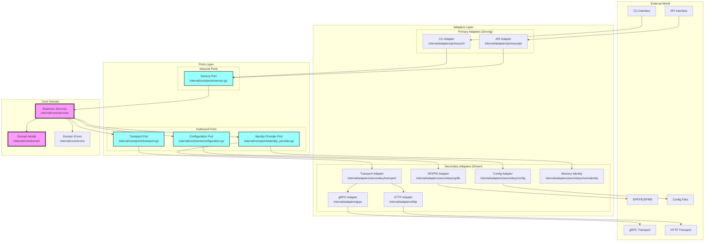
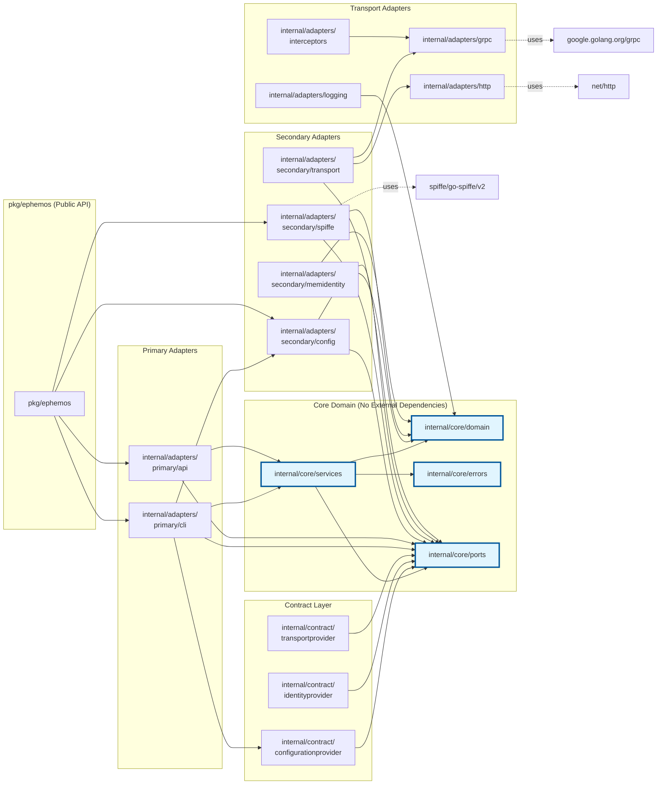

# Ephemos Architecture Documentation

## Hexagonal Architecture (Ports & Adapters)

Ephemos follows a clean hexagonal architecture pattern that enforces strict dependency rules and separation of concerns.

## Dependency Rule Diagram



## Import Graph Snapshot

The following diagram shows the actual import dependencies between packages in the Ephemos architecture:



## Dependency Rules

### ✅ Allowed Dependencies

1. **Core Domain**: 
   - ❌ MUST NOT import from adapters
   - ❌ MUST NOT import from external libraries
   - ✅ CAN import from other core packages

2. **Ports (Interfaces)**:
   - ✅ CAN import from core/domain
   - ❌ MUST NOT import from adapters
   - ❌ MUST NOT import from external libraries

3. **Primary Adapters** (Driving/Inbound):
   - ✅ CAN import from core/ports
   - ✅ CAN import from core/services
   - ✅ CAN import from contracts
   - ✅ CAN import from external libraries
   - ❌ MUST NOT import from other adapters directly

4. **Secondary Adapters** (Driven/Outbound):
   - ✅ CAN import from core/ports
   - ✅ CAN import from core/domain
   - ✅ CAN import from external libraries
   - ❌ MUST NOT import from primary adapters
   - ❌ MUST NOT import from core/services

### 🔍 Import Analysis Summary

Based on the current codebase analysis:

```
Core Domain Packages:
├── internal/core/domain       → No external dependencies ✅
├── internal/core/errors       → No external dependencies ✅
├── internal/core/ports        → Only core/domain imports ✅
└── internal/core/services     → Only core/* imports ✅

Primary Adapters:
├── internal/adapters/primary/cli → Imports core + contracts ✅
└── internal/adapters/primary/api → Imports core + contracts ✅

Secondary Adapters:
├── internal/adapters/secondary/config      → Imports core/ports ✅
├── internal/adapters/secondary/spiffe      → Imports core + SPIFFE lib ✅
├── internal/adapters/secondary/memidentity → Imports core/ports ✅
└── internal/adapters/secondary/transport   → Imports core + transport adapters ✅

Transport Implementations:
├── internal/adapters/grpc         → External gRPC libraries ✅
├── internal/adapters/http         → Standard net/http ✅
├── internal/adapters/interceptors → gRPC interceptors ✅
└── internal/adapters/logging      → Logging utilities ✅
```

## Key Architectural Principles

1. **Dependency Inversion**: Core domain defines interfaces (ports) that adapters implement
2. **Single Responsibility**: Each adapter has one clear responsibility
3. **Interface Segregation**: Ports are small and focused
4. **Clean Boundaries**: No circular dependencies between layers
5. **Testability**: Core can be tested without any external dependencies

## Testing Architecture Compliance

The architecture is enforced through automated tests:

```go
// internal/core/ports/architecture_test.go
func TestNoCoreImportsAdapters(t *testing.T) {
    // Verifies core packages don't import from adapters
}

func TestNoCircularDependencies(t *testing.T) {
    // Ensures no circular imports exist
}
```

## Benefits of This Architecture

1. **Maintainability**: Changes in external systems don't affect core business logic
2. **Testability**: Core domain can be tested in isolation
3. **Flexibility**: Easy to swap implementations (e.g., SPIFFE → OAuth)
4. **Clarity**: Clear separation of concerns and responsibilities
5. **Security**: Security concerns isolated in specific adapters

## Example: Adding a New Transport

To add a new transport (e.g., WebSocket):

1. Create adapter: `internal/adapters/websocket/`
2. Implement transport port: `internal/core/ports/transport.go`
3. Register in transport adapter: `internal/adapters/secondary/transport/`
4. No changes needed in core domain! ✅

## Import Verification Commands

```bash
# Check for illegal imports from core to adapters
go list -f '{{.ImportPath}} {{.Imports}}' ./internal/core/... | grep adapters

# Visualize dependency graph
go mod graph | grep internal/

# Check for circular dependencies
go list -f '{{join .Deps "\n"}}' ./internal/... | sort | uniq -c | sort -rn
```

---

*Last Updated: December 2024*
*Architecture Version: 2.0*