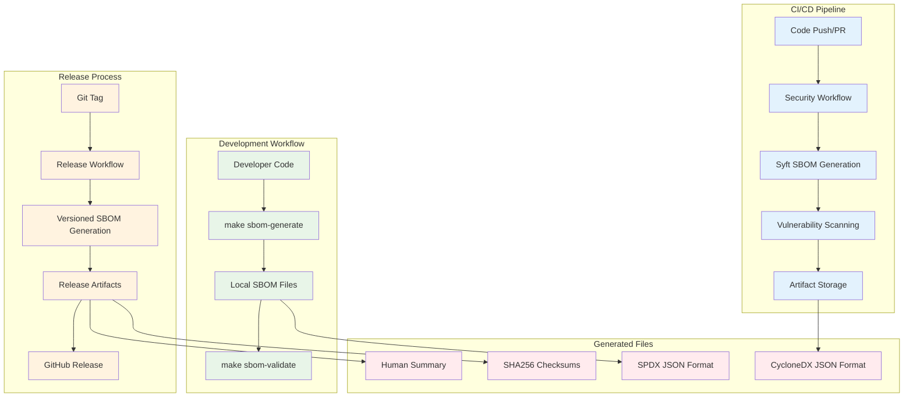

# Ephemos SBOM Feature Documentation

**Software Bill of Materials (SBOM) Generation and Verification**

## 📋 Feature Overview

Ephemos provides comprehensive, automated Software Bill of Materials (SBOM) generation to support supply chain security, vulnerability management, and regulatory compliance. This feature generates industry-standard SBOM files that catalog all software dependencies and components in the project.

### Key Capabilities

- **🔄 Automated Generation**: Integrated into CI/CD pipelines and development workflows
- **📊 Multiple Formats**: SPDX 2.3 and CycloneDX JSON formats for maximum tool compatibility
- **🔐 Security Integration**: Built-in vulnerability scanning and correlation
- **✅ Validation**: Comprehensive validation of SBOM structure and content
- **📈 Compliance Ready**: Supports NTIA, Executive Order 14028, ISO/IEC 5962, and NIST frameworks
- **🛡️ Integrity Protection**: Cryptographic checksums for tamper detection

## 🛠️ Implementation Details

### Tool Selection: Syft by Anchore

**Why Syft?**
- **Industry Standard**: Widely adopted by security-conscious organizations
- **Go Expertise**: Excellent at analyzing Go modules and dependency graphs
- **Format Support**: Native SPDX and CycloneDX output
- **CI/CD Friendly**: Simple CLI tool with no code dependencies
- **Active Development**: Maintained by Anchore security team

### Architecture Integration



## 📁 Generated Artifacts

### File Structure

When SBOM generation completes, the following files are created in the `sbom/` directory:

```
sbom/
├── ephemos-v1.0.0-sbom.spdx.json          # SPDX 2.3 format
├── ephemos-v1.0.0-sbom.cyclonedx.json     # CycloneDX format
├── ephemos-v1.0.0-sbom-summary.txt        # Human-readable summary
└── ephemos-v1.0.0-sbom-checksums.txt      # SHA256 integrity checksums
```

### File Descriptions

#### 1. SPDX Format (`*.spdx.json`)
**Purpose**: Industry-standard compliance and legal analysis
**Best For**: Compliance teams, license analysis, regulatory reporting

```json
{
  "spdxVersion": "SPDX-2.3",
  "dataLicense": "CC0-1.0",
  "SPDXID": "SPDXRef-DOCUMENT",
  "documentName": "ephemos",
  "packages": [
    {
      "SPDXID": "SPDXRef-Package-go-module-example",
      "name": "github.com/spiffe/go-spiffe/v2",
      "downloadLocation": "https://github.com/spiffe/go-spiffe",
      "filesAnalyzed": false,
      "versionInfo": "v2.5.0",
      "supplier": "Organization: SPIFFE",
      "licenseConcluded": "Apache-2.0",
      "licenseDeclared": "Apache-2.0"
    }
  ]
}
```

#### 2. CycloneDX Format (`*.cyclonedx.json`)
**Purpose**: Security-focused analysis and vulnerability correlation
**Best For**: Security teams, vulnerability scanners, DevSecOps tools

```json
{
  "bomFormat": "CycloneDX",
  "specVersion": "1.4",
  "serialNumber": "urn:uuid:12345678-1234-5678-9abc-123456789012",
  "version": 1,
  "metadata": {
    "timestamp": "2025-01-15T10:30:00Z",
    "tools": ["syft"]
  },
  "components": [
    {
      "type": "library",
      "bom-ref": "pkg:golang/github.com/spiffe/go-spiffe/v2@v2.5.0",
      "name": "github.com/spiffe/go-spiffe/v2",
      "version": "v2.5.0",
      "scope": "required",
      "licenses": [{"license": {"id": "Apache-2.0"}}]
    }
  ]
}
```

#### 3. Human Summary (`*-summary.txt`)
**Purpose**: Quick overview for developers and auditors
**Best For**: Code reviews, dependency analysis, documentation

```
Ephemos Software Bill of Materials (SBOM) Summary
==================================================

Project: ephemos
Version: v1.0.0
Generated: 2025-01-15T10:30:00Z
Generator: Syft v0.98.0

Files Generated:
- SPDX Format (JSON): ephemos-v1.0.0-sbom.spdx.json (45KB)
- CycloneDX Format (JSON): ephemos-v1.0.0-sbom.cyclonedx.json (38KB)

Component Summary:
==================
Total Components: 42

Direct Dependencies (from go.mod):
====================================
github.com/spf13/cobra v1.9.1
github.com/spiffe/go-spiffe/v2 v2.5.0
github.com/stretchr/testify v1.10.0
google.golang.org/grpc v1.74.2
google.golang.org/protobuf v1.36.7
gopkg.in/yaml.v3 v3.0.1

Security-Relevant Packages:
===========================
- github.com/spiffe/go-spiffe/v2 v2.5.0
- google.golang.org/grpc v1.74.2
- golang.org/x/crypto v0.41.0
- github.com/go-jose/go-jose/v4 v4.0.5
```

#### 4. Checksums File (`*-checksums.txt`)
**Purpose**: Integrity verification and tamper detection
**Best For**: Security validation, compliance audits, change detection

```
Ephemos SBOM Checksums
======================
Generated: 2025-01-15T10:30:00Z

a1b2c3d4e5f6789012345678901234567890abcdef1234567890abcdef123456  ephemos-v1.0.0-sbom.spdx.json
b2c3d4e5f6789012345678901234567890abcdef1234567890abcdef1234567  ephemos-v1.0.0-sbom.cyclonedx.json
c3d4e5f6789012345678901234567890abcdef1234567890abcdef12345678  ephemos-v1.0.0-sbom-summary.txt
```

## 🚀 Usage Guide

### Development Workflow

#### Generate SBOM Locally

```bash
# Complete SBOM workflow (recommended)
make sbom-all

# Or step-by-step:
make sbom-generate  # Generate SBOM files
make sbom-validate  # Validate structure and content

# Direct script execution
./scripts/security/generate-sbom.sh
./scripts/security/validate-sbom.sh
```

#### Review Generated SBOMs

```bash
# Quick summary view
cat sbom/ephemos-*-summary.txt

# List all components
jq '.packages[].name' sbom/*.spdx.json | sort

# Check licenses
jq '.packages[].licenseConcluded' sbom/*.spdx.json | sort | uniq

# Security-focused packages
jq '.packages[] | select(.name | contains("crypto") or contains("spiffe") or contains("grpc"))' sbom/*.spdx.json
```

### CI/CD Integration

#### Automatic Generation

SBOMs are automatically generated in these scenarios:

1. **Daily Security Scan**: `security.yml` workflow at 1 AM UTC
2. **Dependency Changes**: When `go.mod` or `go.sum` files change
3. **Pull Requests**: For validation and change review
4. **Releases**: Complete SBOM artifacts in GitHub releases

#### Accessing CI/CD Artifacts

```bash
# Download from GitHub Actions
gh run download <run-id> --name ephemos-sbom-complete

# Download from GitHub Release
gh release download v1.0.0 --pattern "*sbom*"
```

### Production Deployment

#### SBOM Verification in Production

```bash
# Verify SBOM integrity
cd sbom && sha256sum -c ephemos-*-checksums.txt

# Validate SBOM structure
make sbom-validate

# Check for known vulnerabilities
osv-scanner --sbom sbom/ephemos-sbom.spdx.json
grype sbom:sbom/ephemos-sbom.spdx.json
trivy sbom sbom/ephemos-sbom.spdx.json
```

## 🔍 Artifact Verification Guide

### 1. File Integrity Verification

Verify that SBOM files haven't been tampered with:

```bash
# Navigate to SBOM directory
cd sbom/

# Verify all checksums
sha256sum -c ephemos-*-checksums.txt

# Expected output:
# ✅ ephemos-v1.0.0-sbom.spdx.json: OK
# ✅ ephemos-v1.0.0-sbom.cyclonedx.json: OK
# ✅ ephemos-v1.0.0-sbom-summary.txt: OK
```

**Manual Checksum Verification:**

```bash
# Generate fresh checksum
sha256sum ephemos-v1.0.0-sbom.spdx.json

# Compare with stored checksum
grep "spdx.json" ephemos-*-checksums.txt

# They should match exactly
```

### 2. SBOM Structure Validation

Verify SBOM files contain valid, complete data:

```bash
# Automated validation
make sbom-validate

# Manual JSON validation
jq empty sbom/*.json && echo "✅ All JSON files are valid"

# Check for required fields (SPDX)
jq -e '.spdxVersion, .documentName, .packages' sbom/*.spdx.json > /dev/null && echo "✅ SPDX structure valid"

# Check for required fields (CycloneDX)
jq -e '.bomFormat, .specVersion, .components' sbom/*.cyclonedx.json > /dev/null && echo "✅ CycloneDX structure valid"
```

### 3. Content Completeness Verification

Ensure SBOM contains expected components:

```bash
# Count total components
echo "SPDX Components: $(jq '.packages | length' sbom/*.spdx.json)"
echo "CycloneDX Components: $(jq '.components | length' sbom/*.cyclonedx.json)"

# Verify critical dependencies are present
critical_deps=("github.com/spiffe/go-spiffe/v2" "google.golang.org/grpc" "golang.org/x/crypto")

for dep in "${critical_deps[@]}"; do
    if jq -e ".packages[] | select(.name == \"$dep\")" sbom/*.spdx.json > /dev/null; then
        echo "✅ $dep found in SBOM"
    else
        echo "❌ $dep missing from SBOM"
    fi
done
```

### 4. Version Consistency Verification

Verify SBOM versions match expected project version:

```bash
# Extract version from SBOM filename
sbom_version=$(ls sbom/ephemos-*-sbom.spdx.json | sed -n 's/.*ephemos-\(v[0-9.]*\)-.*/\1/p')

# Compare with git tag (if in release context)
git_version=$(git describe --tags --exact-match 2>/dev/null || echo "dev")

echo "SBOM Version: $sbom_version"
echo "Git Version: $git_version"

if [ "$sbom_version" = "$git_version" ]; then
    echo "✅ Version consistency verified"
else
    echo "⚠️ Version mismatch detected"
fi
```

### 5. License Compliance Verification

Verify all dependencies have acceptable licenses:

```bash
# Extract all licenses
jq -r '.packages[].licenseConcluded' sbom/*.spdx.json | sort | uniq > licenses.txt

# Check for problematic licenses
problematic_licenses=("GPL-2.0" "GPL-3.0" "AGPL-3.0" "LGPL-2.1" "LGPL-3.0")

echo "📋 License Analysis:"
for license in "${problematic_licenses[@]}"; do
    if grep -q "$license" licenses.txt; then
        echo "⚠️ Found potentially problematic license: $license"
    fi
done

# Show license summary
echo ""
echo "📊 License Summary:"
cat licenses.txt | grep -v "NOASSERTION" | sort | uniq -c | sort -nr
```

### 6. Vulnerability Correlation Verification

Verify SBOM can be used for vulnerability scanning:

```bash
# Test with OSV Scanner
if command -v osv-scanner >/dev/null 2>&1; then
    echo "🔍 Testing vulnerability scanning with OSV Scanner..."
    osv-scanner --sbom sbom/ephemos-*-sbom.spdx.json --format json > vuln-results.json
    
    if [ $? -eq 0 ]; then
        echo "✅ SBOM successfully processed by OSV Scanner"
        vuln_count=$(jq '.results[].packages[].vulnerabilities | length' vuln-results.json 2>/dev/null | paste -sd+ | bc 2>/dev/null || echo "0")
        echo "📊 Vulnerabilities found: $vuln_count"
    else
        echo "❌ SBOM processing failed in OSV Scanner"
    fi
else
    echo "⚠️ OSV Scanner not available for testing"
fi

# Test with Grype (if available)
if command -v grype >/dev/null 2>&1; then
    echo "🔍 Testing vulnerability scanning with Grype..."
    grype sbom:sbom/ephemos-*-sbom.spdx.json -o json > grype-results.json
    
    if [ $? -eq 0 ]; then
        echo "✅ SBOM successfully processed by Grype"
        match_count=$(jq '.matches | length' grype-results.json 2>/dev/null || echo "0")
        echo "📊 Vulnerability matches: $match_count"
    else
        echo "❌ SBOM processing failed in Grype"
    fi
else
    echo "⚠️ Grype not available for testing"
fi
```

### 7. Comprehensive Verification Script

Create a complete verification script:

```bash
#!/bin/bash
# comprehensive-sbom-verification.sh

set -e

echo "🔍 Ephemos SBOM Comprehensive Verification"
echo "========================================="

# Navigate to SBOM directory
if [ ! -d "sbom" ]; then
    echo "❌ SBOM directory not found. Run 'make sbom-generate' first."
    exit 1
fi

cd sbom/

echo ""
echo "1️⃣ File Integrity Verification"
echo "==============================="
if sha256sum -c ephemos-*-checksums.txt; then
    echo "✅ All checksums verified successfully"
else
    echo "❌ Checksum verification failed"
    exit 1
fi

echo ""
echo "2️⃣ JSON Structure Validation"
echo "============================="
if jq empty *.json; then
    echo "✅ All JSON files have valid syntax"
else
    echo "❌ JSON syntax validation failed"
    exit 1
fi

echo ""
echo "3️⃣ SBOM Format Compliance"
echo "=========================="
# SPDX validation
if jq -e '.spdxVersion, .documentName, .packages' *.spdx.json > /dev/null; then
    echo "✅ SPDX format compliance verified"
else
    echo "❌ SPDX format validation failed"
    exit 1
fi

# CycloneDX validation
if jq -e '.bomFormat, .specVersion, .components' *.cyclonedx.json > /dev/null; then
    echo "✅ CycloneDX format compliance verified"
else
    echo "❌ CycloneDX format validation failed"
    exit 1
fi

echo ""
echo "4️⃣ Content Completeness"
echo "======================="
spdx_count=$(jq '.packages | length' *.spdx.json)
cyclonedx_count=$(jq '.components | length' *.cyclonedx.json)

echo "📊 Components found:"
echo "   SPDX: $spdx_count packages"
echo "   CycloneDX: $cyclonedx_count components"

if [ "$spdx_count" -gt 5 ] && [ "$cyclonedx_count" -gt 5 ]; then
    echo "✅ Component counts appear reasonable"
else
    echo "⚠️ Low component count may indicate incomplete scan"
fi

echo ""
echo "5️⃣ Critical Dependencies Check"
echo "=============================="
critical_deps=("github.com/spiffe/go-spiffe/v2" "google.golang.org/grpc")
all_found=true

for dep in "${critical_deps[@]}"; do
    if jq -e ".packages[] | select(.name == \"$dep\")" *.spdx.json > /dev/null; then
        echo "✅ $dep found"
    else
        echo "❌ $dep missing"
        all_found=false
    fi
done

if [ "$all_found" = true ]; then
    echo "✅ All critical dependencies found"
else
    echo "❌ Missing critical dependencies"
    exit 1
fi

echo ""
echo "6️⃣ File Size Validation"
echo "======================="
for file in *.json; do
    size=$(wc -c < "$file")
    if [ "$size" -gt 1000 ]; then
        echo "✅ $file: ${size} bytes (reasonable size)"
    else
        echo "❌ $file: ${size} bytes (suspiciously small)"
        exit 1
    fi
done

echo ""
echo "🎉 SBOM Verification Complete"
echo "============================="
echo "All verification checks passed successfully!"
echo ""
echo "📋 Summary:"
echo "- File integrity: ✅ Verified"
echo "- JSON syntax: ✅ Valid"
echo "- Format compliance: ✅ SPDX & CycloneDX"
echo "- Content completeness: ✅ $spdx_count/$cyclonedx_count components"
echo "- Critical dependencies: ✅ All found"
echo "- File sizes: ✅ Reasonable"
echo ""
echo "✨ SBOMs are ready for:"
echo "   • Vulnerability scanning"
echo "   • Compliance reporting"
echo "   • Supply chain analysis"
echo "   • License auditing"
```

**Usage:**

```bash
# Make script executable
chmod +x comprehensive-sbom-verification.sh

# Run verification
./comprehensive-sbom-verification.sh
```

## 🔐 Security Integration

### Vulnerability Scanning Integration

#### Using OSV Scanner (Google)

```bash
# Scan SBOM for vulnerabilities
osv-scanner --sbom sbom/ephemos-sbom.spdx.json

# Generate JSON report
osv-scanner --sbom sbom/ephemos-sbom.spdx.json --format json --output vulnerabilities.json

# Filter critical vulnerabilities
jq '.results[].packages[].vulnerabilities[] | select(.severity == "CRITICAL")' vulnerabilities.json
```

#### Using Grype (Anchore)

```bash
# Scan SBOM with Grype
grype sbom:sbom/ephemos-sbom.spdx.json

# Generate detailed report
grype sbom:sbom/ephemos-sbom.spdx.json -o json --file grype-report.json

# Filter by severity
grype sbom:sbom/ephemos-sbom.spdx.json --fail-on high
```

#### Using Trivy (Aqua Security)

```bash
# Scan SBOM with Trivy
trivy sbom sbom/ephemos-sbom.spdx.json

# Generate SARIF format for GitHub
trivy sbom sbom/ephemos-sbom.spdx.json --format sarif --output trivy-results.sarif
```

### Compliance Integration

#### NTIA Minimum Elements Verification

```bash
# Verify NTIA minimum elements
echo "🔍 NTIA Minimum Elements Verification:"
echo "======================================"

# Check for required fields
required_fields=("name" "version" "supplier" "component_hash")
for field in "${required_fields[@]}"; do
    if jq -e ".packages[0].$field" sbom/*.spdx.json > /dev/null 2>&1; then
        echo "✅ $field present"
    else
        echo "⚠️ $field may be missing or have different name"
    fi
done
```

#### Executive Order 14028 Compliance

```bash
# Generate compliance report
echo "📋 Executive Order 14028 Compliance Report" > compliance-report.txt
echo "=========================================" >> compliance-report.txt
echo "Generated: $(date)" >> compliance-report.txt
echo "" >> compliance-report.txt

echo "✅ SBOM Generated: Yes" >> compliance-report.txt
echo "✅ Format: SPDX 2.3 & CycloneDX" >> compliance-report.txt
echo "✅ Component Count: $(jq '.packages | length' sbom/*.spdx.json)" >> compliance-report.txt
echo "✅ Vulnerability Data: Available via scanners" >> compliance-report.txt

cat compliance-report.txt
```

## 📊 Monitoring and Metrics

### SBOM Generation Metrics

Track SBOM generation success and quality:

```bash
# Component count over time
echo "$(date): $(jq '.packages | length' sbom/*.spdx.json)" >> sbom-metrics.log

# File size trends
echo "$(date): $(wc -c < sbom/*.spdx.json)" >> sbom-size-metrics.log

# Vulnerability trends
osv-scanner --sbom sbom/*.spdx.json --format json | \
  jq '.results[].packages[].vulnerabilities | length' | \
  paste -sd+ | bc >> vulnerability-metrics.log
```

### Automated Monitoring

Set up automated monitoring for SBOM quality:

```bash
#!/bin/bash
# sbom-monitor.sh

SBOM_DIR="sbom"
ALERT_THRESHOLD=5  # Minimum expected components

if [ ! -d "$SBOM_DIR" ]; then
    echo "⚠️ SBOM directory missing"
    exit 1
fi

component_count=$(jq '.packages | length' $SBOM_DIR/*.spdx.json)

if [ "$component_count" -lt "$ALERT_THRESHOLD" ]; then
    echo "⚠️ SBOM component count ($component_count) below threshold ($ALERT_THRESHOLD)"
    # Send alert to monitoring system
else
    echo "✅ SBOM component count ($component_count) looks healthy"
fi
```

## 🚨 Troubleshooting

### Common Issues and Solutions

#### Issue: Empty SBOM Files

**Symptoms:**
- SBOM files exist but are very small
- Component count is 0 or very low

**Solutions:**
```bash
# Check if dependencies are downloaded
go mod download

# Verify build artifacts exist
make build

# Check Go module structure
go mod verify

# Regenerate with debug info
syft . -v -o spdx-json
```

#### Issue: Syft Installation Fails

**Symptoms:**
- "syft: command not found"
- SBOM generation script fails

**Solutions:**
```bash
# Install via Go
go install github.com/anchore/syft/cmd/syft@latest

# Install via curl
curl -sSfL https://raw.githubusercontent.com/anchore/syft/main/install.sh | sh -s -- -b /usr/local/bin

# Verify installation
syft --version
```

#### Issue: JSON Validation Fails

**Symptoms:**
- "invalid JSON syntax" errors
- jq commands fail

**Solutions:**
```bash
# Check file permissions
ls -la sbom/

# Validate JSON manually
jq . sbom/*.json

# Regenerate SBOM files
make sbom-generate
```

#### Issue: Missing Critical Dependencies

**Symptoms:**
- SPIFFE/SPIRE packages not in SBOM
- Low component count

**Solutions:**
```bash
# Ensure Go modules are up to date
go mod tidy

# Check for vendor directory conflicts
rm -rf vendor/

# Verify import paths in code
grep -r "github.com/spiffe" .
```

### Debug Mode

Enable debug output for troubleshooting:

```bash
# Debug SBOM generation
SBOM_DEBUG=1 ./scripts/security/generate-sbom.sh

# Verbose Syft output
syft . -v -o spdx-json --file debug-sbom.json
```

## 📚 Related Documentation

- [SBOM Generation Technical Guide](../security/SBOM_GENERATION.md) - Implementation details
- [Security Architecture](../security/SECURITY_ARCHITECTURE.md) - Overall security design
- [CI/CD Security](../security/CI_CD_SECURITY.md) - Pipeline integration
- [Supply Chain Security Best Practices](../security/SUPPLY_CHAIN_SECURITY.md) - Broader context

## 🤝 Support and Contribution

### Getting Help

1. **Documentation**: Check this guide and related security docs
2. **Issues**: File GitHub issues with SBOM generation problems
3. **Logs**: Include full output from generation and validation scripts
4. **Environment**: Provide Go version, OS, and Syft version details

### Contributing Improvements

1. **Script Enhancements**: Improve generation or validation scripts
2. **Documentation**: Update this guide with new use cases
3. **Integration**: Add support for additional SBOM consumers
4. **Validation**: Enhance verification procedures

---

**Note**: This SBOM feature is production-ready and automatically integrated into the Ephemos development and release workflows. No additional configuration is required for basic usage.