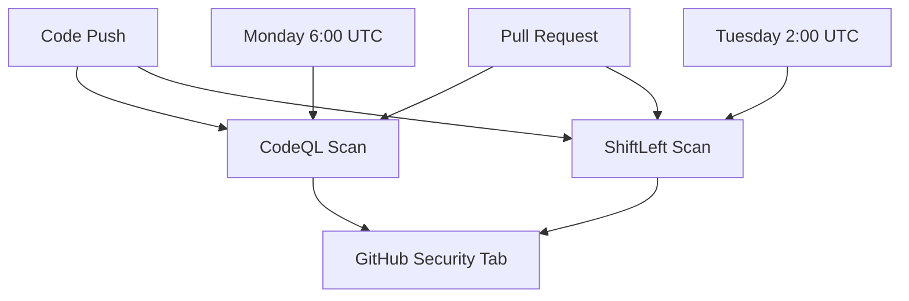

# Static Application Security Testing (SAST) Implementation

This document describes the SAST (Static Application Security Testing) implementation for the Ephemos project to ensure comprehensive code security analysis.

## Overview

Ephemos implements multiple layers of static security analysis:

1. **GitHub CodeQL** - Primary SAST tool for comprehensive security analysis
2. **ShiftLeft Security** - Additional vulnerability scanning and dependency analysis
3. **Gosec** - Go-specific security linter (integrated in CI)
4. **Go Vulnerability Database** - Dependency vulnerability scanning

## CodeQL Analysis

### Configuration

- **File**: `.github/workflows/codeql.yml`
- **Languages**: Go
- **Triggers**: 
  - Push to main/develop branches
  - Pull requests to main
  - Weekly scheduled scan (Mondays at 6:00 AM UTC)
- **Query Suites**: 
  - `security-extended`: Extended security queries
  - `security-and-quality`: Combined security and code quality

### Features

- **Autobuild**: Automatic compilation detection and build
- **SARIF Upload**: Results uploaded to GitHub Security tab
- **Artifact Storage**: Analysis artifacts preserved for 5 days
- **Pinned Actions**: All actions use SHA-pinned versions for security

### Permissions

```yaml
permissions:
  actions: read          # Read workflow artifacts
  contents: read         # Read repository contents
  security-events: write # Write to Security tab
```

## ShiftLeft Security Scan

### Configuration

- **File**: `.github/workflows/sast-scan.yml`
- **Scan Types**:
  - `credscan`: Credential and secret scanning
  - `go`: Go-specific SAST analysis
  - `depscan`: Dependency vulnerability scanning
- **Schedule**: Tuesday at 2:00 AM UTC (complements CodeQL)

### Integration

- Results uploaded to GitHub Security tab via SARIF format
- Artifacts retained for 30 days
- Continues on error to ensure CI pipeline stability

## Security Query Coverage

### CodeQL Security Queries

CodeQL analyzes for common security vulnerabilities including:

- **Injection Attacks**:
  - SQL injection
  - Command injection
  - Path traversal
  - Template injection

- **Authentication & Authorization**:
  - Weak authentication mechanisms
  - Authorization bypass
  - Session management issues

- **Cryptography**:
  - Weak cryptographic algorithms
  - Insecure random number generation
  - Certificate validation issues

- **Memory Safety** (Go-specific):
  - Buffer overflows
  - Use-after-free vulnerabilities
  - Race conditions

### ShiftLeft Coverage

- **Credential Scanning**: Detects hardcoded secrets, API keys, passwords
- **Dependency Analysis**: Known vulnerabilities in third-party packages
- **Go Security**: Go-specific security anti-patterns

## Workflow Integration

### Trigger Strategy



### Fail-Fast Approach

- **CodeQL**: Fails on high-severity security issues
- **ShiftLeft**: Continues on error to avoid blocking deployments
- Both tools upload results regardless of scan outcome

## Viewing Results

### GitHub Security Tab

1. Navigate to **Security** tab in GitHub repository
2. Select **Code scanning alerts**
3. Filter by tool: `CodeQL` or `ShiftLeft`
4. Review findings by severity: `Critical`, `High`, `Medium`, `Low`

### Artifacts

- CodeQL artifacts: Available for 5 days
- ShiftLeft reports: Available for 30 days
- Access via Actions → Workflow run → Artifacts

## Remediation Workflow

### High/Critical Severity

1. **Block merging**: High-severity findings should block PR merging
2. **Immediate triage**: Security team review within 24 hours  
3. **Fix priority**: Address before next release

### Medium/Low Severity

1. **Create issues**: Track in GitHub Issues with `security` label
2. **Planned remediation**: Address in upcoming sprints
3. **Risk acceptance**: Document accepted risks

## Configuration Files

### Custom CodeQL Queries

To add custom security queries:

```yaml
# .github/workflows/codeql.yml
- name: Initialize CodeQL
  uses: github/codeql-action/init@...
  with:
    queries: +security-extended,security-and-quality,./security/custom-queries
```

### Query Exclusions

To exclude false positives:

```yaml
# .github/codeql/codeql-config.yml
name: "Custom CodeQL Config"
queries:
  - uses: security-and-quality
paths-ignore:
  - "**/*_test.go"      # Exclude test files
  - "examples/**"       # Exclude example code
  - "vendor/**"         # Exclude vendored dependencies
```

## Compliance & Standards

### Security Standards

- **NIST Cybersecurity Framework**: Identify, Protect, Detect
- **OWASP Top 10**: Coverage for web application security risks
- **CWE (Common Weakness Enumeration)**: Vulnerability classification
- **SARIF 2.1.0**: Standard format for security scan results

### Scorecard Integration

This SAST implementation addresses the **OpenSSF Scorecard** requirements:

- ✅ GitHub-hosted repository with CodeQL integration
- ✅ `github/codeql-action` usage in workflows
- ✅ Regular scanning via push, PR, and scheduled triggers
- ✅ Results uploaded to GitHub Security tab

## Monitoring & Metrics

### Key Performance Indicators

- **Scan Success Rate**: Percentage of successful scans
- **Mean Time to Detection (MTTD)**: Time from vulnerability introduction to detection
- **Mean Time to Resolution (MTTR)**: Time from detection to fix
- **False Positive Rate**: Percentage of false alerts

### Reporting

Monthly security reports should include:

- Number of vulnerabilities found by severity
- Trend analysis over time
- Top vulnerability categories
- Remediation metrics

## Troubleshooting

### Common Issues

**CodeQL Autobuild Failure**:
```yaml
# Replace autobuild with manual build
- name: Build Go project
  run: |
    go mod download
    go build -v ./...
```

**ShiftLeft Scan Timeout**:
```yaml
# Add timeout and retry logic  
- name: Perform ShiftLeft Security Scan
  timeout-minutes: 30
  uses: ShiftLeftSecurity/scan-action@master
```

**SARIF Upload Issues**:
```yaml
# Verify SARIF file location and format
- name: Debug SARIF files
  run: find . -name "*.sarif" -exec cat {} \;
```

## Best Practices

1. **Pin Action Versions**: Use SHA hashes instead of tags
2. **Least Privilege**: Minimal required permissions
3. **Regular Updates**: Keep scanning tools updated
4. **Result Review**: Regular triage of findings
5. **Developer Training**: Security awareness and secure coding practices

## References

- [GitHub CodeQL Documentation](https://docs.github.com/en/code-security/code-scanning/using-codeql-code-scanning)
- [OpenSSF Scorecard SAST Check](https://github.com/ossf/scorecard/blob/main/docs/checks.md#sast)
- [SARIF Format Specification](https://docs.github.com/en/code-security/code-scanning/integrating-with-code-scanning/sarif-support-for-code-scanning)
- [Go Security Best Practices](https://go.dev/security/)