# Ephemos Threat Model

This document provides a comprehensive threat model for the Ephemos identity management system, focusing on SPIFFE-based identity provisioning, rotation, and revocation mechanisms.

## Table of Contents

1. [System Overview](#system-overview)
2. [Identity Provisioning Threats](#identity-provisioning-threats)
3. [Identity Rotation Threats](#identity-rotation-threats)
4. [Identity Revocation Threats](#identity-revocation-threats)
5. [Trust Boundaries](#trust-boundaries)
6. [Attack Vectors](#attack-vectors)
7. [Mitigations](#mitigations)
8. [Monitoring and Detection](#monitoring-and-detection)

## System Overview

Ephemos provides SPIFFE-based identity management for service-to-service authentication using X.509-SVID certificates. The system consists of:

- **SPIRE Server**: Issues and manages SPIFFE identities
- **SPIRE Agent**: Workload attestation and SVID delivery
- **Ephemos Library**: Simplified SPIFFE integration for applications
- **Workloads**: Services requesting and using SPIFFE identities


## Identity Provisioning Threats

### Threat Model: Identity Bootstrap

```mermaid
sequenceDiagram
    participant A as Attacker
    participant SA as SPIRE Agent
    participant SS as SPIRE Server
    participant WL as Workload
    participant EL as Ephemos Library
    
    Note over A,EL: Identity Provisioning Flow
    
    WL->>+EL: Request Identity
    EL->>+SA: Fetch X509-SVID
    SA->>+SS: Attest Workload
    
    Note over A: 🚨 Threat: Workload Impersonation
    A-->>SA: Fake Workload Request
    SA-->>A: ❌ Attestation Fails
    
    SS->>+SA: Issue SVID
    SA->>+EL: Deliver SVID
    EL->>+WL: Return Identity
    
    Note over A: 🚨 Threat: Man-in-the-Middle
    A-->>EL: Intercept SVID
    EL-->>A: ❌ Unix Socket Protection
```



### Provisioning Threats

| Threat ID | Threat | Impact | Likelihood | Risk |
|-----------|--------|---------|------------|------|
| **P001** | **Workload Impersonation** | High | Medium | High |
| | Malicious process claims legitimate workload identity | | | |
| **P002** | **SPIRE Agent Compromise** | Critical | Low | High |
| | Attacker gains control of SPIRE Agent | | | |
| **P003** | **Unix Socket Hijacking** | High | Low | Medium |
| | Unauthorized access to SPIRE Agent socket | | | |
| **P004** | **Registration Entry Manipulation** | High | Medium | High |
| | Unauthorized modification of SPIRE entries | | | |
| **P005** | **Certificate Authority Compromise** | Critical | Very Low | Medium |
| | SPIRE Server's root CA is compromised | | | |

## Identity Rotation Threats

### Threat Model: SVID Rotation

```mermaid
sequenceDiagram
    participant A as Attacker
    participant WL as Workload
    participant EL as Ephemos Library
    participant SA as SPIRE Agent
    participant SS as SPIRE Server
    
    Note over WL,SS: Normal Rotation Flow
    
    loop Every 30 minutes (default)
        SA->>SS: Request New SVID
        SS->>SA: Issue New SVID
        SA->>EL: Update SVID
        EL->>WL: Notify of Update
        
        Note over A: 🚨 Threat: Rotation Disruption
        A-->>SA: Block Rotation Request
        SA-->>A: ❌ Network Protection
        
        Note over A: 🚨 Threat: Stale SVID Usage
        A-->>WL: Force Use of Old SVID
        WL-->>A: ❌ Auto-rotation Enforced
    end
    
    Note over A: 🚨 Threat: Certificate Replay
    A-->>WL: Present Old Certificate
    WL-->>A: ❌ Expiration Check
```



### Rotation Threats

| Threat ID | Threat | Impact | Likelihood | Risk |
|-----------|--------|---------|------------|------|
| **R001** | **Rotation Failure** | Medium | Medium | Medium |
| | SVID rotation fails, service uses expired certs | | | |
| **R002** | **Clock Skew Attacks** | Medium | Low | Low |
| | Manipulated system time affects cert validation | | | |
| **R003** | **Rotation Timing Attacks** | Low | Low | Very Low |
| | Predict rotation timing for targeted attacks | | | |
| **R004** | **Certificate Replay** | Medium | Medium | Medium |
| | Reuse of previously valid but expired certificates | | | |
| **R005** | **Rotation Disruption** | High | Low | Medium |
| | Network attacks prevent rotation communication | | | |

## Identity Revocation Threats

### Threat Model: Identity Revocation

```mermaid
graph TD
    subgraph "Revocation Triggers"
        RT1[Security Incident]
        RT2[Service Decommission]
        RT3[Compromise Detection]
        RT4[Policy Change]
        RT5[Certificate Expiry]
    end
    
    subgraph "Revocation Process"
        RP1[Delete SPIRE Entry]
        RP2[Update Trust Bundle]
        RP3[Notify Services]
        RP4[Block New Issuance]
    end
    
    subgraph "Attack Scenarios"
        AS1[🚨 Delayed Revocation]
        AS2[🚨 Revocation Bypass]
        AS3[🚨 DoS via Revocation]
        AS4[🚨 Incomplete Revocation]
    end
    
    RT1 --> RP1
    RT2 --> RP1
    RT3 --> RP1
    RT4 --> RP1
    RT5 --> RP4
    
    RP1 --> RP2
    RP2 --> RP3
    RP1 --> RP4
    
    RP1 -.-> AS1
    RP2 -.-> AS2
    RP1 -.-> AS3
    RP3 -.-> AS4
    
    classDef trigger fill:#ffebee
    classDef process fill:#e8f5e8
    classDef attack fill:#fff3e0
    
    class RT1,RT2,RT3,RT4,RT5 trigger
    class RP1,RP2,RP3,RP4 process
    class AS1,AS2,AS3,AS4 attack
```



### Revocation Threats

| Threat ID | Threat | Impact | Likelihood | Risk |
|-----------|--------|---------|------------|------|
| **V001** | **Delayed Revocation** | High | Medium | High |
| | Compromised identity not revoked quickly enough | | | |
| **V002** | **Revocation Bypass** | High | Low | Medium |
| | Services continue accepting revoked identities | | | |
| **V003** | **Mass Revocation DoS** | Medium | Low | Low |
| | Bulk revocation causes service disruption | | | |
| **V004** | **Incomplete Revocation** | Medium | Medium | Medium |
| | Some services not notified of revocation | | | |
| **V005** | **Revocation Authority Compromise** | Critical | Very Low | Medium |
| | Attacker can revoke legitimate identities | | | |

## Trust Boundaries


## Attack Vectors

### 1. Network-Based Attacks

```mermaid
graph LR
    subgraph "Network Threats"
        NT1[Man-in-the-Middle]
        NT2[Traffic Interception]
        NT3[DNS Poisoning] 
        NT4[Network Segmentation Bypass]
        NT5[Certificate Injection]
    end
    
    subgraph "Communication Channels"
        CC1[SPIRE Server ↔ Agent]
        CC2[Agent ↔ Workload]
        CC3[Workload ↔ Workload]
        CC4[Admin ↔ SPIRE Server]
    end
    
    NT1 --> CC1
    NT1 --> CC3
    NT2 --> CC2
    NT3 --> CC1
    NT4 --> CC2
    NT5 --> CC3
    
    classDef threat fill:#ffebee
    classDef channel fill:#e1f5fe
    
    class NT1,NT2,NT3,NT4,NT5 threat
    class CC1,CC2,CC3,CC4 channel
```



### 2. Host-Based Attacks


## Mitigations

### Identity Provisioning Mitigations

| Mitigation ID | Control | Implementation |
|---------------|---------|---------------|
| **M001** | **Workload Attestation** | Unix PID/UID-based attestation |
| **M002** | **Socket Permissions** | Restrict agent socket to specific users/groups |
| **M003** | **Registration Validation** | Admin approval required for new entries |
| **M004** | **Mutual TLS** | All SPIRE communications use mTLS |
| **M005** | **Hardware Security** | Store root CA keys in HSM |

### Rotation Mitigations

| Mitigation ID | Control | Implementation |
|---------------|---------|---------------|
| **M006** | **Automatic Rotation** | Enforce regular SVID rotation (30min default) |
| **M007** | **Grace Periods** | Allow overlap during rotation |
| **M008** | **Clock Synchronization** | NTP sync across all nodes |
| **M009** | **Rotation Monitoring** | Alert on rotation failures |
| **M010** | **Backup Mechanisms** | Fallback rotation paths |

### Revocation Mitigations

| Mitigation ID | Control | Implementation |
|---------------|---------|---------------|
| **M011** | **Rapid Revocation** | Automated revocation on compromise detection |
| **M012** | **Certificate Validation** | Always check current certificate status |
| **M013** | **Short Certificate Lifetimes** | Default 1-hour SVID lifetime |
| **M014** | **Revocation Propagation** | Push updates to all consuming services |
| **M015** | **Emergency Procedures** | Manual revocation capabilities |

## Monitoring and Detection

### Security Monitoring Architecture


### Key Security Metrics

| Metric | Threshold | Action |
|--------|-----------|--------|
| **Failed Attestations** | >5 in 5 minutes | Alert + Investigation |
| **Rotation Failures** | >2 consecutive | Emergency rotation |
| **Certificate Validation Errors** | >10 in 1 minute | Service health check |
| **Unauthorized Socket Access** | Any occurrence | Immediate alert |
| **SPIRE Service Downtime** | >30 seconds | Failover activation |

### Detection Rules

```yaml
# Example security detection rules
detection_rules:
  - name: "Suspicious Workload Registration"
    condition: "new_registration AND unknown_selector"
    severity: "HIGH"
    action: "alert_and_quarantine"
    
  - name: "Mass Certificate Requests"
    condition: "cert_requests > 100 in 1m"
    severity: "MEDIUM" 
    action: "rate_limit"
    
  - name: "Certificate Validation Bypass"
    condition: "cert_expired AND connection_accepted"
    severity: "CRITICAL"
    action: "emergency_revoke"
    
  - name: "Agent Communication Failure"
    condition: "agent_heartbeat_missed > 3"
    severity: "HIGH"
    action: "investigate_node"
```

## Security Assessment Summary

### Overall Risk Profile

- **High Risk Areas**: Identity provisioning, delayed revocation
- **Medium Risk Areas**: Network attacks, rotation failures  
- **Low Risk Areas**: Physical access, timing attacks

### Key Recommendations

1. **Implement comprehensive monitoring** for all identity lifecycle events
2. **Reduce certificate lifetimes** to minimize exposure windows
3. **Automate incident response** for common attack scenarios
4. **Regular security audits** of SPIRE configuration and policies
5. **Network segmentation** to limit attack surface

### Compliance Considerations

- **SOC 2**: Identity lifecycle management controls
- **ISO 27001**: Access control and key management
- **PCI DSS**: Network security and encryption requirements
- **NIST Cybersecurity Framework**: Identity and access management

---

*This threat model should be reviewed quarterly and updated based on new threats, system changes, and security incidents.*